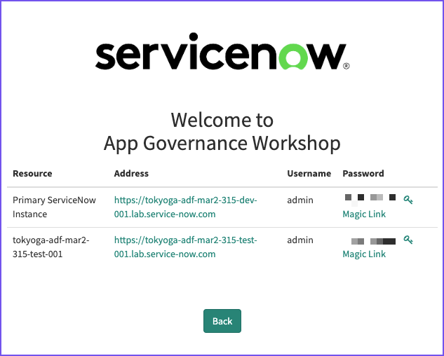

App Engine Innovation Workshop Lab Guide 
{: .fs-8 .fw-300 .m-0}

---
{: .mt-0}

# How to get your Lab instance

[Prev](../){: .btn .mr-2 .fs-2}
[Next](02-introduction.md){: .btn .btn-green .fs-2}

Your instructor will provide you with a URL that will load a form similar to below. 

Enter your name and email address, then click "Register for Lab". 

{: .important}
Return to this page and enter the same information if you lose your credentials or access to your instance

Next, enter the unique registration code provided by your instructor and click "Complete Registration".

You will be presented with a final screen containing the URL for your instance(s).

You may click on the "Magic Link" to be taken directly to the instance and automatically logged in. 

[Prev](../){: .btn .mr-2 .fs-2}
[Next](02-introduction.md){: .btn .btn-green .fs-2})