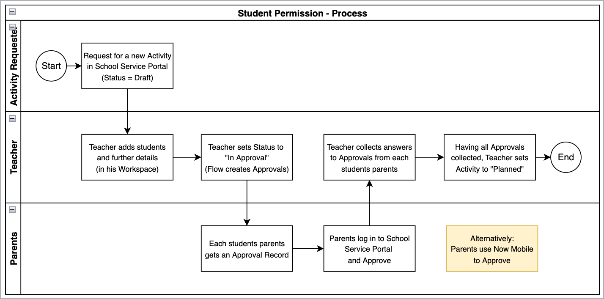

App Engine Innovation Workshop Lab Guide
{: .fs-8 .fw-500 }

- [Introduction](#introduction)
- [Story and Overall process](#story-and-overall-process)

# Introduction

*In this lab, you will learn how to set up a new App in ServiceNow using App Engine Studio.*
{: .fs-6 .fw-300 }

*Starting with adding tables to your app, you will also add different user interfaces to make the app shine. Additionally, you do not need to write a single line of code for this.*
{: .fs-6 .fw-300 }

Lab Outline
{: .fs-6 .fw-300 }

| Time | Task |
|--|--|
| 10 Minutes | Getting Started |
| 5 Minutes  | Exercise 1: Create a new app with App Engine Studio|
| 15 Miniutes| Exercise 2: Import data and create tables|
| 15 Minutes | Exercise 3: Configure list & form layout|
| 15 Minutes | Exercise 4: Start the process from the Parent Portal|
| 10 Minutes | Exercise 5: Create a teacher workspace|
| 5 Minutes  | Summary & Outlook|

# Story and Overall process

Imagine a school that wants to plan **students activities** (e.g. a summer camp). The Activities need to be stored in a **central location**, where the **teacher** leading the activity needs to collect the **Approvals** from the students' **parents**, so that the students are **allowed to attend** the given activity.

As soon as the teacher received all responses to the Approvals, he/she can set the activity to a **Planned** state.

Workflow
{: .fs-6 .fw-300 }

The app will:

* offer the option to capture **Student Activities** from a central location.

* Provide people a request for new activities using the ServiceNow Service Portal.

* The new activities requested are be assigned to a teacher in charge, who then adds the list of students/attendees for this specific activity.

* The teacher then sets the Activity record to **In Approval** where the system creates an approval and sends a **Notification** the the student's parent(s), to ask for permission to attend.

* The parent(s) respond to the notification by approving or rejecting

* As soon as the teacher has collected all approvals, the Activity Record is set to *Planned* - at which point the current progress of the workflow is visible.

* Provide different user inferfaces for the different persona involved (Requester, Teacher and Parents).

The Diagram below shows the overall process that we are about to implement with the *Student Permission* App.

> **Note**: This lab focuses on the base tables needed and the user interfaces, to present.

