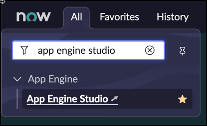

# Exercise 0: Getting Started

Goal
{: .fs-6 .fw-300 }

This exercise provides prerequisites for subsequent exercises.

Steps
{: .fs-6 .fw-300 }

1. Log in to your instance

1. Download the Excel File you will need later in this Lab.

    [Click here to Download the Excel file](Activities.xlsx)

1. Open App Engine Studio in your instance by navigating to **All > App Engine > App Engine Studio**.

    

App Engine Studio will open with a Welcome Screen. Just close this dialog by either clicking the "x" icon in the top-right corner, or by clicking **Get Started**.

You are now all set to start with your hands-on exercises.

