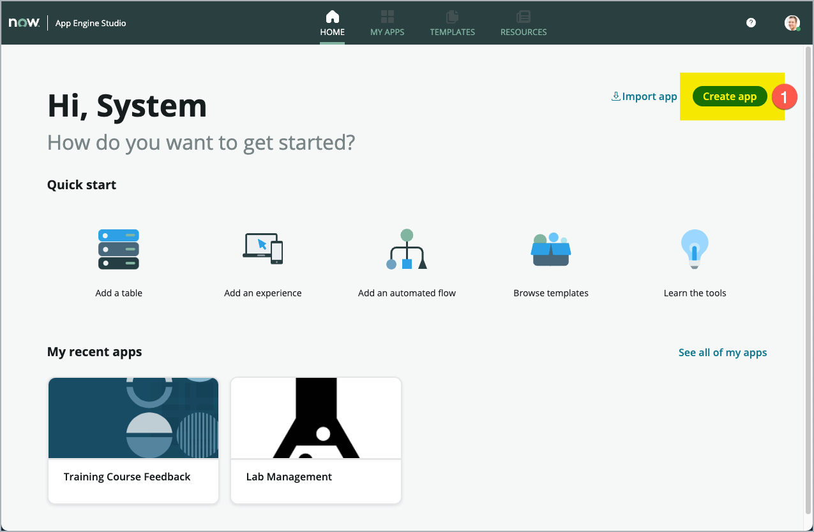

App Engine Innovation Workshop Lab Guide 
{: .fs-8 .fw-300 .m-0}

---
{: .mt-0}

# Exercise 1: Create a new App with AES

[Prev](05-exercise-0.md){: .btn .mr-2 .fs-2}
[Next](20-exercise-2.md){: .btn .btn-green .fs-2}

Goal
{: .fs-6 .fw-300 }

In this exercise, you will create a new **App** in **App Engine Studio**. The application can be thought of as a *container* to place all the artifacts created within this Lab.

1. To create a new **App** in **App Engine Studio**, click **Create app (1)**.

    

1. Give your App a meaningful **Name (1)** and a short **Description (2)**.

    | Fieldname | Value |
    |--|--|
    |Name|Student Permission|
    |Description|Manage permissions on students’ activities|

1. Having the fields filled in, click **Continue (3)**.

    

1. In the screen shown, you could add Roles to your App, which are used to assign permissions to users. For this Lab, we will just stay with the both Roles added for you by App Engine Studio. Click **Continue (3)**.

    

    After just a few seconds, your app is created in your instance.

    

1. Next, click **Go to app dashboard (1).**. This system displays the **App Dashboard** within App Engine Studio.

    

    > Hint: To get more screen space, click the oggle switch (1) on the lower left side of the screen.

    

Congratulations! You now have set up a new in *App Engine Studio* within its own App Scope.

This App can easily be tested and promoted from your development instance to test and production instances. You can also invite other developers to collaborate on your app on your instance.

[Prev](05-exercise-0.md){: .btn .mr-2 .fs-2}
[Next](20-exercise-2.md){: .btn .btn-green .fs-2}