# Introduction

<!-- Chuck's notes:

I have made some notes on comments throughout. Additionally, I have

* removed all   tags, they are not needed and make this lab guide inconsistent with others. They also are marked as errors in Markdown linter making it hard to spot actual errors. If you have questions about formatting or line breaks, let me know.

* Cleaned up some spelling and grammar

* Removed a lot of the bold formatting. Reserve this for things that are clicked or typed.

* Removed the time estimates from each section. It's in the intro. Putting it in each section violates the rules provided by our renderer that # tags must be followed by ## tags (for the goal).

* Added alt tags to the images (text between the [])

* Removed the "Steps" section markers. Not needed. Having a numbered list of steps is self-evident and consistent with other lab guides.

-->

## OMG! You've outgrown email and spreadsheets - Now let's do this right

Welcome to CreatorCon Lab CCL1054-K22!

If you found your way here - you are absolutely at the right place!

In this lab, you will learn how to set up a new App in ServiceNow using App Engine Studio.

Starting with adding tables to your app, you will also add different user interfaces to make the app shine. Additionally, you do not need to write a single line of code for this.

This lab is the foundation for other labs you can attend at CreatorCon. Look for CCL1055-K22 through CCL1060-K22 to go even further.

## Outline for this Lab

<!-- Note: I tweaked the section titles a bit -->

| Time | Task |
|--|--|
| 10 Minutes | Getting Started |
| 5 Minutes  | Exercise 1: Create a new app with App Engine Studio|
| 15 Miniutes| Exercise 2: Import data and create tables|
| 15 Minutes | Exercise 3: Configure list & form layout|
| 15 Minutes | Exercise 4: Start the process from the Parent Portal|
| 10 Minutes | Exercise 5: Create a teacher workspace|
| 5 Minutes  | Summary & Outlook|

## Story and Overall process

Imagine a school that wants to plan **students activities** (e.g. a summer camp). The Activities need to be stored in a **central location**, where the **teacher** leading the activity needs to collect the **Approvals** from the students' **parents**, so that the students are **allowed to attend** the given activity.

As soon as the teacher received all responses to the Approvals, he/she can set the activity to a **Planned** state.

### Workflow

The app will:

* offer the option to capture **Student Activities** from a central location.

* Provide people a request for new activities using the ServiceNow Service Portal.

* The new activities requested are be assigned to a teacher in charge, who then adds the list of students/attendees for this specific activity.

* The teacher then sets the Activity record to **In Approval** where the system creates an approval and sends a **Notification** the the student's parent(s), to ask for permission to attend.

* The parent(s) respond to the notification by approving or rejecting

* As soon as the teacher has collected all approvals, the Activity Record is set to *Planned* - at which point the current progress of the workflow is visible.

* Provide different user inferfaces for the different persona involved (Requester, Teacher and Parents).

The Diagram below shows the overall process that we are about to implement with the *Student Permission* App.

> **Note**: This lab focuses on the base tables needed and the user interfaces, to present.

# Getting Started

## Goal

This exercise provides prerequisites for subsequent exercises.

### Steps

1. Log in to your instance

1. Download the Excel File you will need later in this Lab.

    [Click here to Download the Excel file](Activities.xlsx)

1. Open App Engine Studio in your instance by navigating to **All > App Engine > App Engine Studio**.

    

App Engine Studio will open with a Welcome Screen. Just close this dialog by either clicking the "x" icon in the top-right corner, or by clicking **Get Started**.

You are now all set to start with your hands-on exercises

# Exercise 1: Create a new App with App Engine Studio

## Goal

In this exercise, you will create a new **App** in **App Engine Studio**. The application can be thought of as a *container* to place all the artifacts created within this Lab.

1. To create a new **App** in **App Engine Studio**, click **Create app (1)**.

    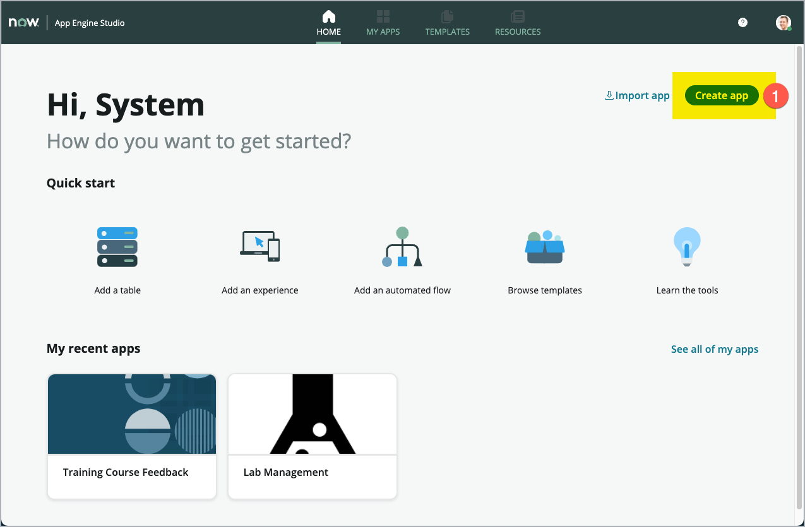

1. Give your App a meaningful **Name (1)** and a short **Description (2)**.

    | Fieldname | Value |
    |--|--|
    |Name|Student Permission|
    |Description|Manage permissions on students’ activities|

1. Having the fields filled in, click **Continue (3)**.

    

1. In the screen shown, you could add Roles to your App, which are used to assign permissions to users. For this Lab, we will just stay with the both Roles added for you by App Engine Studio. Click **Continue (3)**.

    

    After just a few seconds, your app is created in your instance.

    

1. Next, click **Go to app dashboard (1).**. This system displays the **App Dashboard** within App Engine Studio.

    

    > Hint: To get more screen space, click the oggle switch (1) on the lower left side of the screen.

    

Congratulations! You now have set up a new in *App Engine Studio* within its own App Scope.

This App can easily be tested and promoted from your development instance to test and production instances. You can also invite other developers to collaborate on your app on your instance.

# Exercise 2: Import data and create tables

## Goal

In this exercise, you will add **new tables** to your App.

This is the place where your data will be stored within your ServiceNow Instance. Because ServiceNow has a database built-in on the platform, it is very easy to create new tables for your App.

## Add the first table (Import from spreadsheet)

The first table you create, will be set up in an **easy and fast** way, by importing and converting an existing Excel file to a working table in ServiceNow.

In the same moment, you will also **import the data** from the Excel file into the new table in your App.

**Let's go...**

1. Start adding tables by clicking the **Add** button **(1)** in the **Data** section.

    > **Note**: You can find the sections from the App Dashboard in App Engine Studio, where we stopped the previous exercise.

    

1. Select the option **Create a table (1)** - see screenshot below (in your instance, this card may be shown on the left, instead on the right like shown in the screenshot).

    

1. Click **Get started (1)**.

    > **Note**: If the button **Get started** is not visible on your screen, scroll down a bit.

    

1. In the next step, click the left-most option **Upload a spreadsheet (1)** and click **Continue (2)**.

    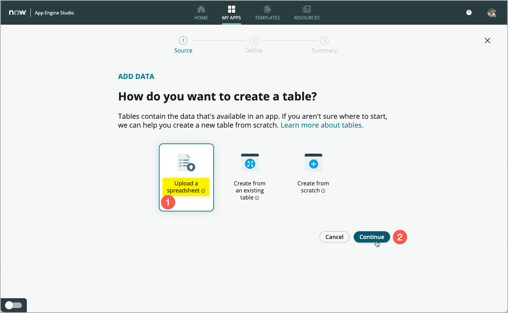

1. Now add your **previously downloaded** Excel **spreadsheet** to import the data **structure** and the **data** in **one step**.

    You can click the link **(1)** to open your file selector dialog **OR** you can also drag and drop the file to the box **(1)** on the form.

    > **Note**: For convenience, here is the link to the Excel spreadsheet once more:

    [Click here to Download the Excel file](Activities.xlsx)

    

    

1. As soon as your **Excel file** is selected, you can see it shown in the dialog **(1)** - see screenshot below.

    Leave the value **"1"** in the field for the header line **(2)**. This defines the row in your Excel file holding the **field names** for your new table to create and import.

    Make sure, that you check the **Import spreadsheet data** checkbox **(3)**.

    This ensures that not only the table structure will be created, but also the data from the Excel spreadsheet will be imported to the newly created table as well.

    Click **Continue (4)** to move on.

    > **Note**: You can change the selected file, if you chose a wrong file. To chose a different file, click the trashcan icon and select the file desired.

    

    The system then analyzes the Excel file. This takes a few seconds.

    

    For reference, you can see the content of the Excel file in the screenshot below:

    

    Review the table columns identified from the previous step.
  
1. Find the *Status* field **(1)** and change the *Type* of that field to **Choice (2)**.

    This results in the Status field displayed as a **dropdown field in ServiceNow**, where all options from the Excel file are available for selection automatically.

    

1. Scroll down in the list of fields to the *Teacher** field **(1)** and change the **Type** column **(2)** to **Reference**.

    In the *Reference table* column **(3)** select the **User [sys_user]** table from the list of tables.
    
    > **Note**: As this list contains a lot of tables, type **sys_user** in the search field to faster find the User table.

    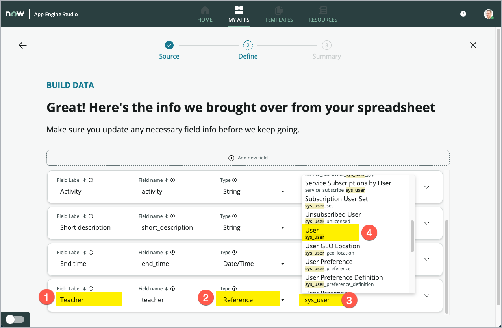

1. Click the **Continue** button **(4)**.

    > **Note**: The *Teacher* field references an existing system table (*User [sys_user]*). Using a reference field here improves reporting capabilities and reduces human data entry issues.

1. Enter the name **Activity** for the new table in the *Table label* field **(1)**. No changes are needed for *Table name* (2).

1. Select the **Auto number** checkbox **(3)** and enter **ACTIV** (all capital letters) in the **Prefix** field **(4)**. The Prefix is used for the automatic numbering of records, e.g. like "ACTIV0001001", giving each row in the table a unique human readable number.

    No changes are needed to the two fields *Starting number* and *Number of digits (5)*.

1. Click **Continue (6)**.

    

1. In this step, you define, which Roles will have access to the table data in it.
Mark the checkbox in the **All** column for the "admin" Role (1) and the "user" Role (2). Then click **Continue (3)** to proceed.

    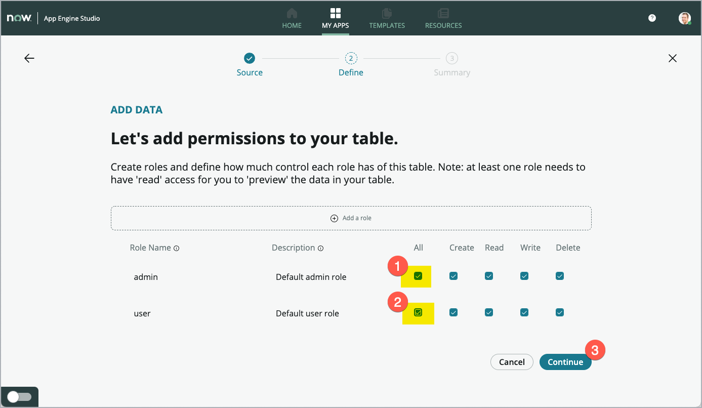

    The system takes a few seconds to create the table and import the data from the spreadsheet to the new table.

    

1. When the import has finished, click **Done (1)**.

    

    You can now see, that your table is shown in the *Data section* of your App Dashboard.

    

## Add the second table (Create from existing table)

Now, let's add another table to your app. This time, create a new table based on the structure of an existing table (the **Task** table) in ServiceNow.

<!-- Removed the Note below because it said the same thing -->

By *extending* an existing table, your new table inherts several fields and functionality from the original table. This can save a lot of time when making tables when the situation calls for it.

1. On the *App Dashboard*, click **Add (1)** in the *Data* section.

    

1. Again, the wizard for adding tables to your app is started.

1. Like for the first table, click on the right-hand option **Create a table (1)**.

    

1. Scroll down a bit an click **Get stated (1)**.

    

1. This time, click the option in the middle **Create from an existing table (1)** then click **Continue (2)**.

    

1. In the *Table* field **(1)**, select the **Task [task]** table and click **Continue (2)**.

    > **ATTENTION**: There are a lot of tables named something with ***“task”***. Be sure to choose the table named **Task [task]**. Type **Task** in the Table field to narrow the list of tables shown in the dropdown. Then select the table named "Task" (with the small "task" below).

    

    

1. In the *Table label* field **(1)**, enter **Permission Task** and check the **Auto number** heckbox **(2)**.

1. Enter **PERMTASK** (all in capital letters) in the **Prefix** field **(3)**. No other fields need to be changed here.

1. Click **Continue (4)** to proceed.

    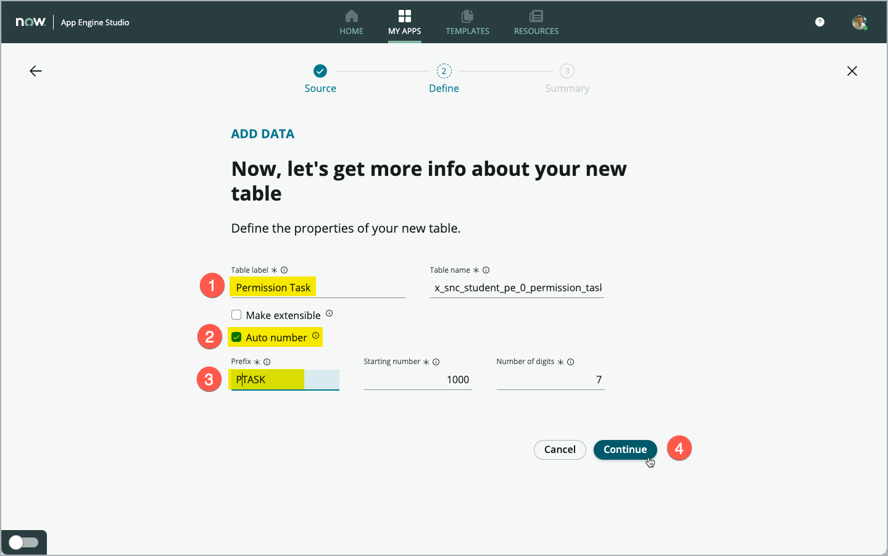

1. Mark the both checkboxes in the "All" column (1) and (2) to allow access to the new table for the "admin" and "user" role of your App. Then click **Continue**.

    

    The system takes a few seconds to create the new table in your app.

    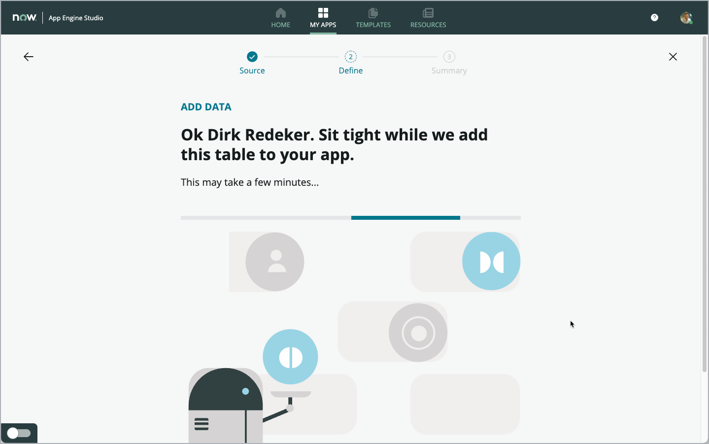

1. Click **Done** to end the wizard and return to your App Dashboard

    

    Verify that you have the **Permission Task** table now also added to your app.

    

### !!! Congratulations !!!

You have just created two new tables for your app. The tables and their data will be stored in the database of your instance.

You used two different methods to create those tables. The first, uploading an Excel spreadsheet and the second, extending form an existing table in your instance.

> **Remember**: the *Task* table is a very central and important table in ServiceNow. Starting workflows by extending from the Task table provides a lot of functionality to your app as a baseline. That is a very nice and fast way to jump start new applications.

# Exercise 3: Configure List & Form Layout

## Goal

In this exercise, you will design the list and forms for your new tables, so that they have a meaningful layout for later use.

This all can be done in very fast and easy way - without writing any single line of code.

## Configure the Activity List & Form

1. Start by going to your app's *App Dashboard*.

1. Click **Preview (1)** on the *Activity* table **(1)**.

    

    A new Web Browser tab **(1)** opens and the prebuilt list layout for the *Activity table* is displayed. How nice, you do not need to build a view from scratch. The system does this automatically for you at the same time the tables were created.

    > **Note**: You can see, that each record imported now has a unique *Number (2)* and that the *Teacher* column **(3)** is now a reference field (in blue letters, shown like a hyperlink). Instead of just using the name of the given teacher in that column, it refers to a specific user record in the *User [sys_user]* table, which we specified during the import.

    The *User* table is another important base table. It's where all users are stored. You can leverage it for your new app and do not need to create a separate user table for each app.

    

    Now it's time to adjust the list layout a bit. We'll order the fields from left to right.

    Move your mouse over the header of the **Number** column **(1)** so that the three vertical dots (1) appear and click on the three-dot button to open the **Column Context-menu***.

1. In the menu that opens, select **Configure (2)** and in the sub-menu select **List Layout (3)**.

    

1. Select the **End time** field (1) and use the ***Up*** and ***Down*** buttons **(2)** to adjust the order of the field to what is shown in the screenshot.

    > **Note**: You can configure the List according to your preferences. For this Lab, just make sure, that the **Number** field **(3)** will remain the first field in the List.

    When you have finished adjusting the List fields, click **Save (4)**.

    

    The Fields are now arranged in the List in the way you just set them up.

    Now let’s review and configure the Form of the Activity table.

1. From the your App Dashboard, click the **Activity table** name **(1)**.

    

    The table builder opens and a splash screen appears.

1. Click the **X** in the upper-right corner of the popup to close the Welcome screen.

    

1. Click **Form views (1)** to open *Form Builder*. Form Builder enables you to design the layout of the form for this table.

    

    > Form Builder is more than a graphical user interface for optimizing your form Layout. Form Builder also allows to add new fields to your form, which instantly become new fields on your table.

    Click **Create a field in the table** to open a popup window to create a new field.

    

    Next, we'll add a new field of type *List*. This type of field allows to collect a number of references in one field (instead of only referencing ONE record).

1. In the *Column label (1)* field type **Students** and in **Column name (2)** type **u_students**.

1. Set the *Type (3)** field to **List** and  the **Table to reference (4)** field to **User** \[sys_user\] table.

1. Click **Add** to add this new field to the table.

    

1. Click **Done** to close the dialog window.

    

1. Finally, drag the new field *Students* from the left-hand side pannel **(1)** onto the form canvas **(2)**.

1. Click **Save** to make the changes permanent.

    

    > **Note**: You can enhance your form layout by adding **Sections** and choose from one or two column format. The fields can easily be arranged by drag-and-drop to make the form fit best to your need. Pay attention to other forms in the system to ensure consistency (e.g. placement of the number field in the upper left.) All this adds up to a much better user experience.

1. Click **Preview** to open a new tab. The system opens a new App Engine Studio tab showing the Form layout

    

    The form shown on the new tab **(1)** looks like the layout used in Workspaces.

    The new **Students (2)** field, that we just added in the steps above, is already shown on the form.

    You can also show the layout shown when using the same Form in the **Plaform UI**.

1. Click **Open form in Platform (3)** to open another Tab in App Engine Studio.

    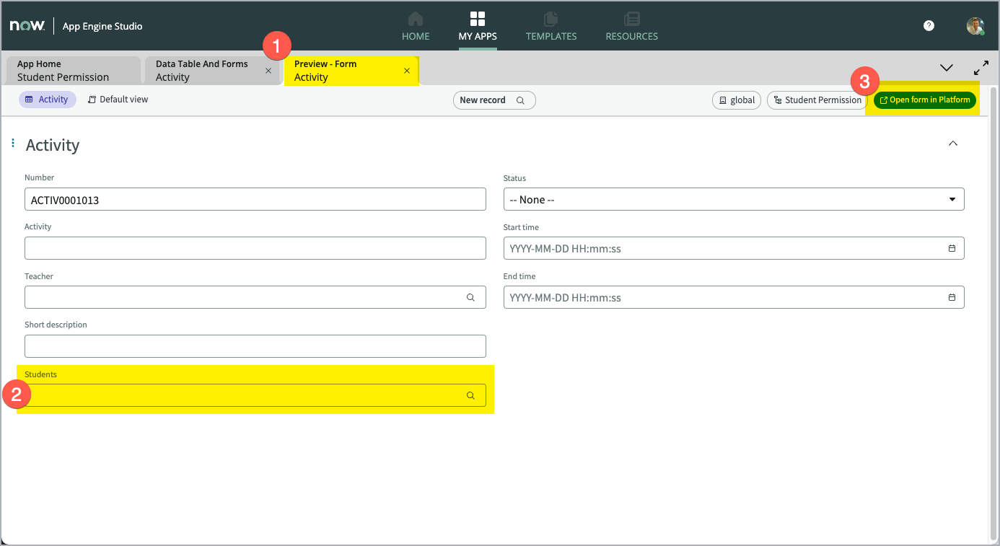

    You can see the layout in the *Platform UI* looks different, especially for the new list field *Students*. However, the functionality is the same for either UI.

    

CONGRATULATIONS! You just achieved to set up your list and form for future use.

# Exercise 4: Start the process from the Parents Portal

<!-- Not sure what this is. Looks like initial thoughts left behind. Doesn't belog so I commented it out

Out

- Record producer with just two fields
    - Activity
    - Short description
- Publish in Service Portal
- Test the Record Producer

 -->

## Goal

In this exercise, you will create a *Record producer* which will be made available in the *Service Catalog* of the *Service Portal*. That way, users can easily add or request new student activities.

The Service Portal is the perfect one-stop-shop for all users to find all requests.

## Configure the Record Producer

1. Navigate to the App Engine Studio Dashboard of your app.

1. Click **Add (1)** in the *Experience* section of the App Dashboard .

    

1. On the next screen, click the **Record producer** tile **(1)**.

    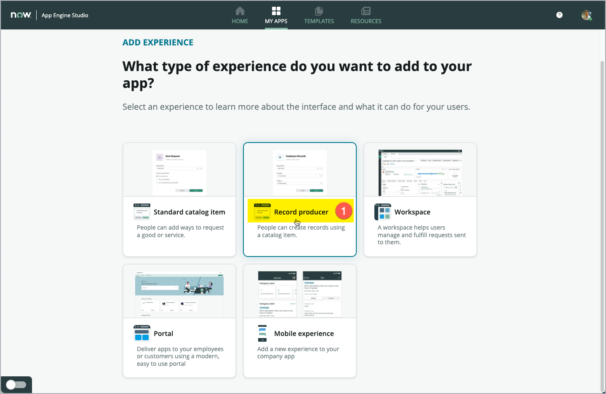

1. Click **Get started (1)**.

    

1. Capture a meaningful *Name (1)* for the new record producer and enter a *Short description (2)* below.

1. Click **Continue (3)** when done.

    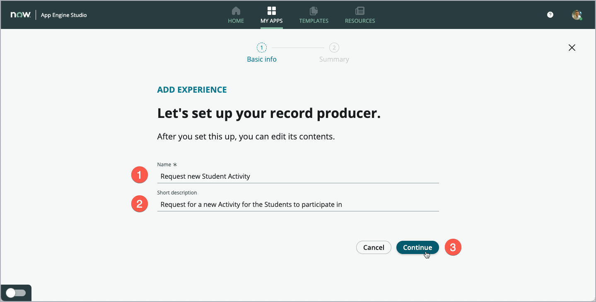

    The system then creates a record producer.

    

1. Click **Edit record producer (1)**.

    

    The *Catalog Builder* is displayed in a new tab inside App Engine Studio.

    On the left-hand side, you can see a *Navigator*. This shows the steps to take to complete the process of building a record producer. Currently we are on the *Details* page **(1)**, which displays the both values *Item name (2)* and *Short description (3)*, that we just entered.

    

1. Scroll down the page and capture a short text in the **Description** field **(1)**. This is shown in Service Portal when the record producer is used.

    > **Note**: You can format your text, insert hyperlinks and even insert images. You can be creative and make your record producer more compelling.

    

1. Select the **Destination** section **(1)** in the left-hand navigator then select the **Activity** table in the **Record submission table** field **(2)**.

    > **Note**: This defines where the data from your record producer is stored.

    

1. Select the **Location** section **(1)** in the left-hand navigator and click **Browse (2)** in the **Catalogs** box on the left side.

    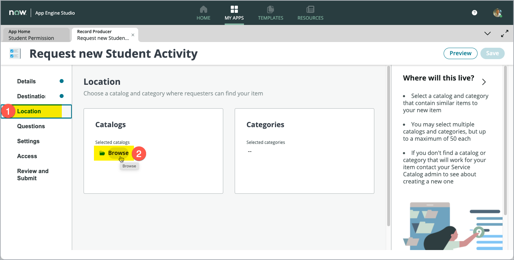

1. On the screen that opens, you now can select the Catalogs, that will contain this Record Producer. All Service Portals using the given Service Catalog with then contain this Record Producer – being available for the users to engage with.

    Select the **Service Catalog** entry in the left list **(1)** and click **Add** button **(2)** to move the selected **Service Catalog** entry to the right list (which is the list of Service Catalogs, the current Record Producer will be available in).

    

1. Review, that the **Service Catalog** entry **(1)** now is shown in the right list and then click **Save selections (2)*.

    

1. Back on the **Location** page **(1)**, check that the **Service Catalog** entry is now listed in the **Catalogs** box **(2)**.

    After selecting to which Catalogs the Record producer will be allocated, we now will select the Categories, where the user can find the Record producer inside the given Catalog.
    Click **Browse (3)** in the Categories box to navigate to the next screen.

    

1. To allocate Categories, select the given Category in the left-hand list **(1)** and click **Add (2)**.

    For our Lab, we select the **Can We Help You?** Category on the left side and click **Add**.

    

1. Review, that the Category now is showing up in the right-hand list **(1)** and then click **Save selections (2)**.

    

1. Check, that the selected Category now will be shown in the right side **Categories** box **(1)**.

    

1. Let’s move on in the next section in the left-hand navigator.
    Select the **Questions** section **(1)** to define the input form fields (questions) that will be shown in Service Portal when using this Record Producer.

    To add the first form field (question), click **Insert new question (2)** in the top part of main form.

    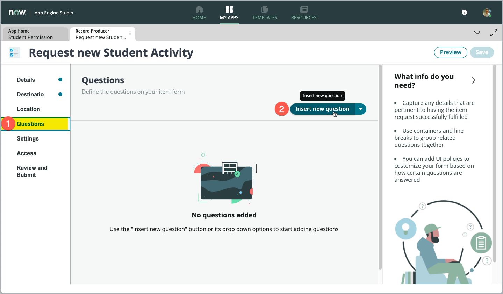

1. The new page that opens, is used to configure the form field / question.
    There are different tabs on this page, which will be relevant for different configuration details. For our Lab, we keep it fast and simple and fill in only a few mandatory fields.

    On the **Question** tab **(1)** leave the **Question type** field with its default value **Text (2)** and select **Single-line** in the **Question subtype** field **(3)**.

    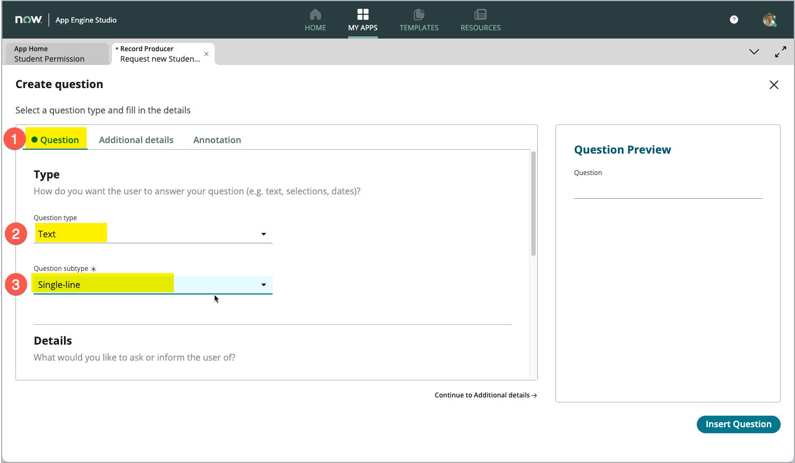

1. Scroll down on the page to the **Details** section.
    Mark the **Map to a specific field on the table** checkbox **(1)**, which makes the **Table field** field appear on the screen.
    Select the **Activity** field in the **Table field** field **(2)**.
    In the **Question label** field **(3)**, capture the label that will be shown in Service Portal for this Record Producer and this specific field (e.g. **“A short name for the Activity”**).
    Leave the default for the **Name** field **(4)** untouched.

    > **Note**: Place your mouse pointer in the main area of the form to scroll down.

    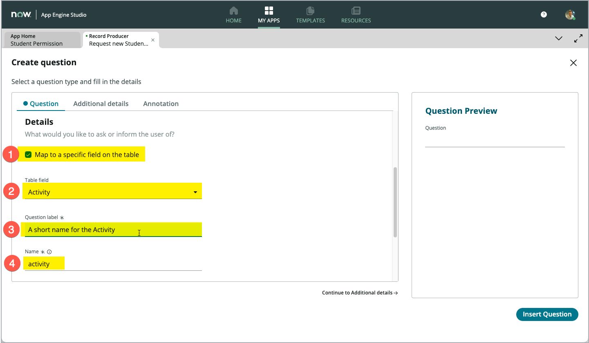

1. Again, scroll down a bit on the page to show the three checkboxes at the bottom of the screen. Select the **Mandatory** checkbox **(1)** and click **Insert Question** **(2)**.

    

1. Back on the **Questions** Page of the Catalog Builder, you can find the question added **(1)** to the list of questions.

    Try another way to add questions to your Record Producer by clicking **Insert** below **(2)** the newly added question.
    In the popup window, select the **New question** option **(3)** to add a second question to your Record Producer.

    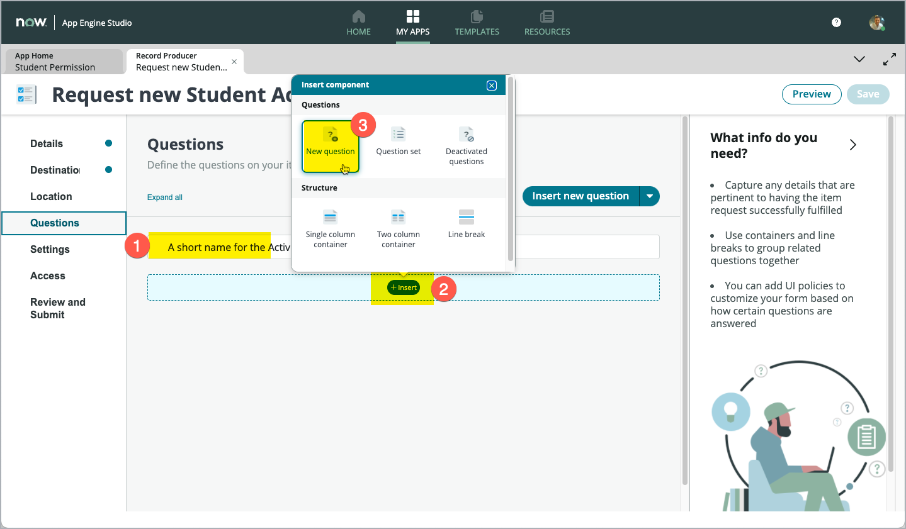

1. On the page that opens, like for the first question, just set the **Question subtype** field on the **Question** tab **(1)** value to **Single-line (3)**. Leave the **Question type** with the default set to **Text (2)**.

    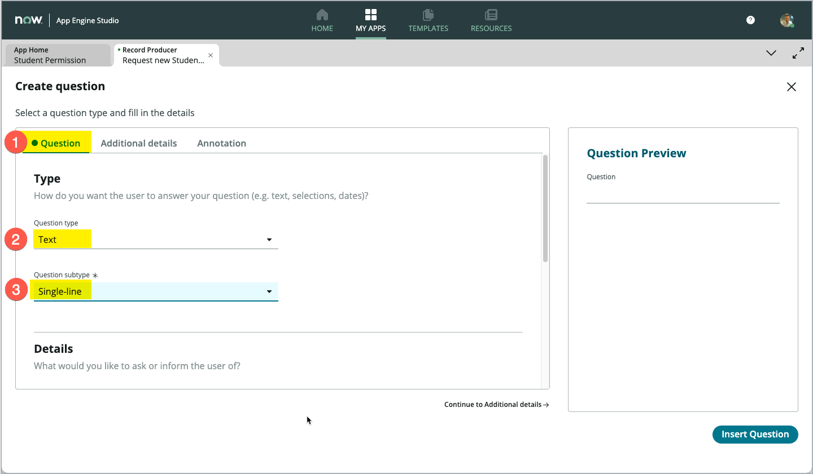

1. Again, select the **Map to a specific field on the table** field **(1)**, and select the **Short description** field in the **Table field** field **(2)**.
    Enter a meaningful label to show for that field/question on the Record Producer in Service Portal, using the **Question label (3)** field (e.g. **Enter a short description for the Activity**).

    We do not want this field/ question to be mandatory, so we can add this question by clicking **Insert Question (4)** right now.

    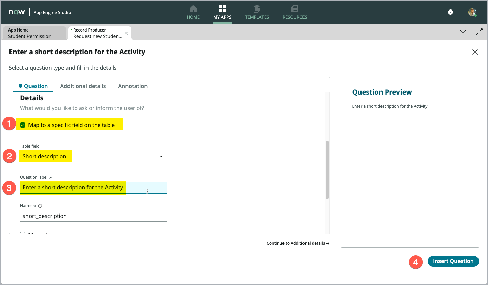

1. Back on the Catalog Builder, you can review that **both question** are now shown in the list of questions **(1)**.

    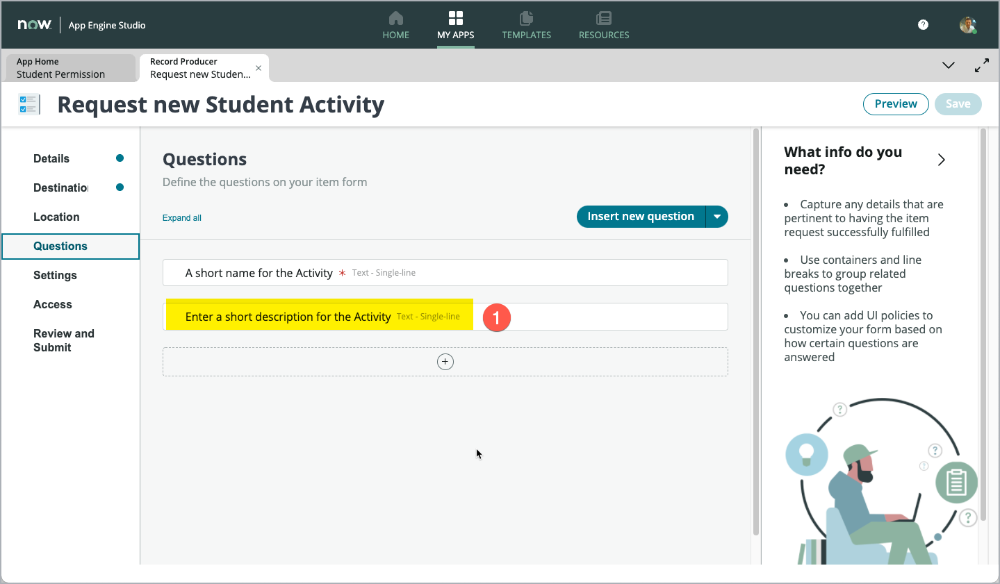

1. Select the **Settings** section **(1)** in the left-hand navigator and mark the **Hide ‘Add to wishlist’ button** checkbox **(2)**.

    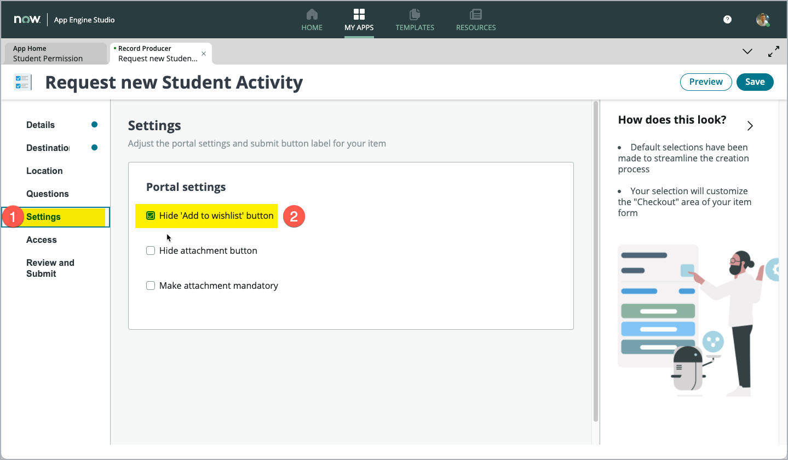

1. Skip the **Access** section in the left-hand navigator and select the **Review and Submit** section **(1)**. Click **Submit (2)** to save and publish the Record Producer to the Service Portal.

    

### GREAT !!!

    Your Record Producer is now available in the Service Portal for your users to Request for new Student Activities.

1. Click **Return to my application (1)** to close the tab with the **Catalog Builder**, which should bring you back to your App dashboard in App Engine Studio.

    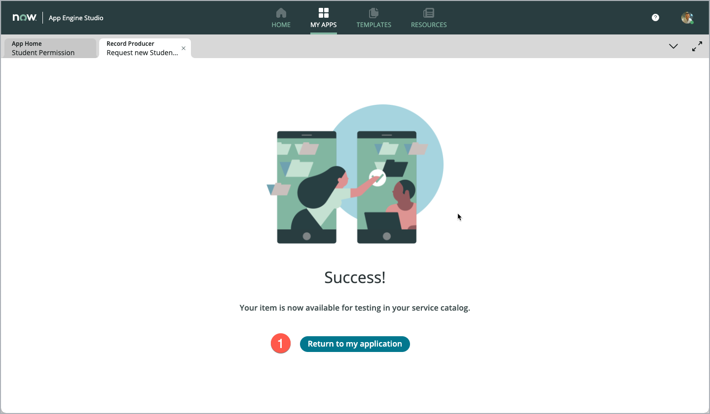

1. Back on the dashboard of your App, review the new **Record producer (1)** showing up in the **Experience** section.

    

## Test the Record Producer in the Portal

1. Open Service Portal
    On a new Web Browser Tab, use the suffix **"/sp"** added to the URL (e.g. "CCL1054-K22.xxxxxx.service-now.com") of your Lab instance to open Service Portal. (https://CCL1054-K22.xxxxxx.service-now.com/sp) make sure to use the correct instance URL from the instance you are now using for this lab, instead of the "xxxx" part above)

1. Click **Request Something (1)** in the left-middle part of Service Portal screen to navigate to the Service Catalog.

    

1. In the left-hand navigation for **Categories** select the **Can We Help You?** category (1), which also will be reflected in the breadcrumbs above. Then find your new Record producer "Request new Student Activity" (2) and click it to navigate to the Record Producer in Service Portal.

    

1. The Record Producer will be shown. To test it, just fill in the fields on the screen (1) and (2). Then, click **Submit** (3) to submit the form and create a new record in the underlying table.

    

## Review the data created

1. From the Dashboard of your App in App Engine Studio, click **Preview** (1) on the **Activity** table.

    

1. Find your newly created record in the list. This will be the record with the highest Number (1).
Click that record on the first column, to open the record in Form view.

    

1. The Form view shows the data captured within the Record Producer on the Service Portal. Review the fields "Activity" (1) and Short description (2).

    

Congratulations, you have successfully created an easy to use form to create new activities.
This Form can easily be found and used from your central Service Portal.

# Exercise 5 - Create a Teachers Workspace

## Goal

This Lab starts from the Dashboard of your App in App Engine Studio

Create the Workspace in App Engine Studio

1. Click **Add (1)** in the **Experience** section on your App Dashboard

    

1. This start the wizard to add another user experience to your App.
    On the first screen of the wizard, chose which kind of experience you want to create.
    This time, click the **Workspace (1)** tile.

    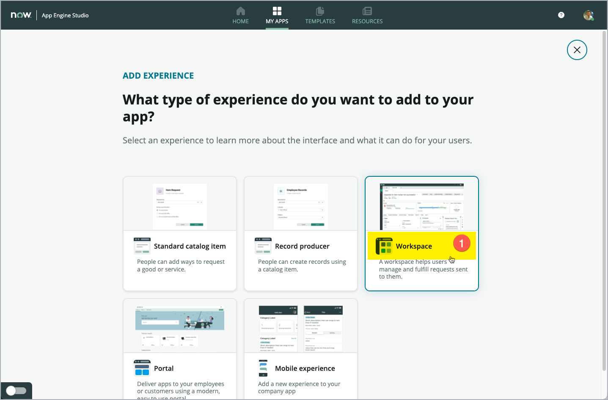

1. You will presented with an example of what a Workspace may look like.
    Just click **Get started (1)** to move on.

    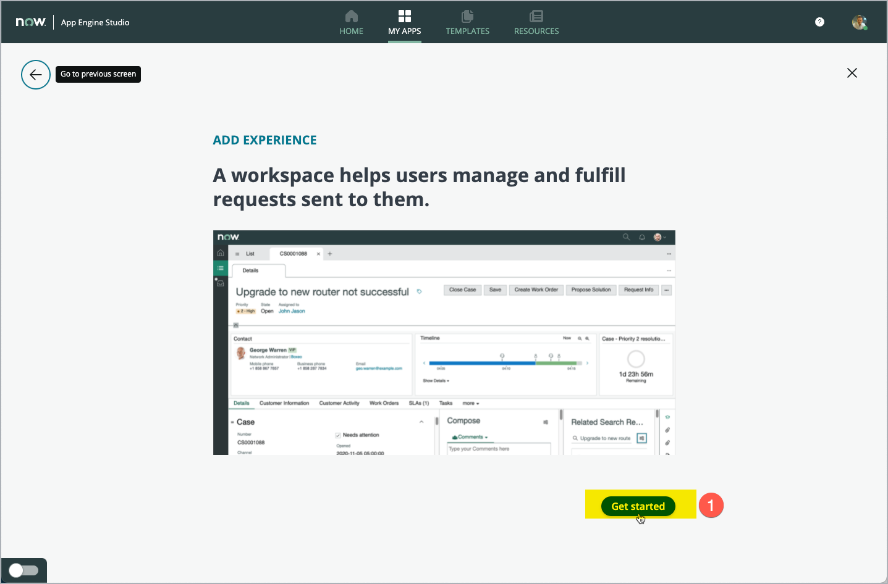

1. The default Name is set to **Student Permission** (the name of your App).
    Leave the **Name** field **(1)** untouched, and enter **Teacher Workspace** in the **Description** field **(2)**.
    The **URL** field **(3)** is filled automatically as well. Leave the value also untouched.

    The **Roles** field **(4)** is used to limit access to the workspace. For this exercise, we leave this field empty as is.

    > **Note**: If the **Continue** button **(5)** is disabled, just click into the **Name (1)** field and press the TAB Key. That will enable the **Continue** button.

    Click **Continue (5)** to move on

    

1. For the "Primary Table" field, selc

    

    

    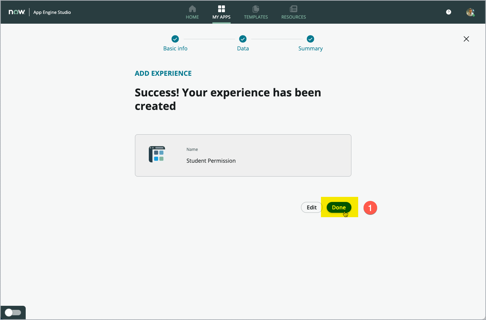

## Review the Workspace

1. Back on you App Dashboard, you will find the new Workspace listed in the "Experience" section (1).
    Click **Preview** to open your newly created Workspace on a new Browser Tab.

    

1. The Workspace will open the landing page, which is more like a dashboard for your App.
    You can find a single score KPI already created for you (1). This counts the number of Records in your Table, you extended from "Task".
    Below, you can find a list with the first five records of your "Activity" table (2). Below the list, you find the Link "View all", which you can use to navigate to the full list of all Activity Records in your table.
    On the left side, you find a vertical navigation bar, which already has some icons prepared for you. The topmost icon (with the small house) navigates to the landing/home page of this Workspace (3) - that is the page you currently are viewing.
    Below (4), you can see an icon to navigate to an overview of all Lists, that are configured for this Workspace. Click this "List" icon (4) to show the list treeview.

    

1. This screens shows the overview of Lists (1) for your Workspace. The left tab "Lists" is predefined by the Administrator and the right tab "My List" can be configured on a per user base individually.
This all is based on very powerful components, which makes up the pages of your new Workspace. They can easily be configured to your specific needs, without writing any line of code.
You find Lists arranged in Categories (2) the List itself (3) depening on the list selected in the left tree structure.
Note, that you already can create "New" record (4), "Export" the data (5), "Edit" (6)existing records and also can used more advanced functions like filtering (7) the data, etc.

    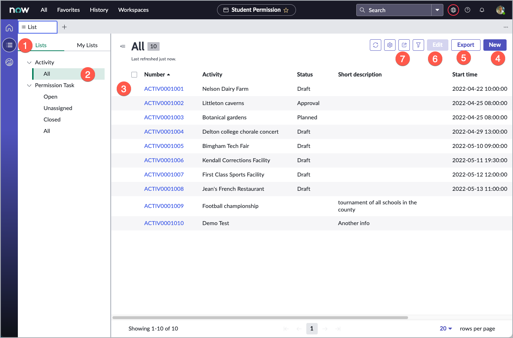

## Results

!!! PERFECT !!!

You just have created your first Workspace with App Engine Studio, just within a few clicks.

# Summary & Outlook

## Summary

Let's have a short recap on the lab and what we just learned:

1. You learned how to create a new App in just a few clicks using App Engine Studio
1. You learned about the App Dashboard and how to navigate
1. You created a new table in seconds by importing from a spreadsheet - without writing any line of code.
1. You created another table by extending from the "Task" table, which brings a lot of functionality
1. You configured the Layout of Lists and Forms
1. You created a new Record Producer for your App, which you also tested instantly on the Service Portal
1. You reviewd the data created by using your new Record Producer in Service Portal
1. Finally, you also created a Workspace for the teacher in just a few clicks, which offers a rich UI

## Outlook

That was a perfect start into the world of No-Code/Low-Code development on the ServiceNow platform.
I hope you enjoyed the lab as much as I did.
If you like to go a step further, watch out for the other Labs from CreatorCon K22. There is a series of Labs, which builds on top of what you created today in this lab.
You do not need the other labs in any sequence, even if they extend this base App. All labs can be run completely individually.

Thanks a lot for attending and enjoy the rest of CreatorCon and Knowledge 2022.

## See you soon!!!

