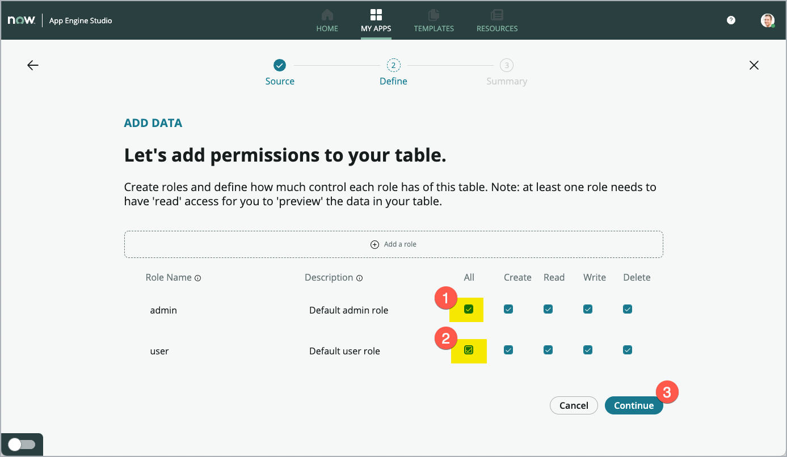
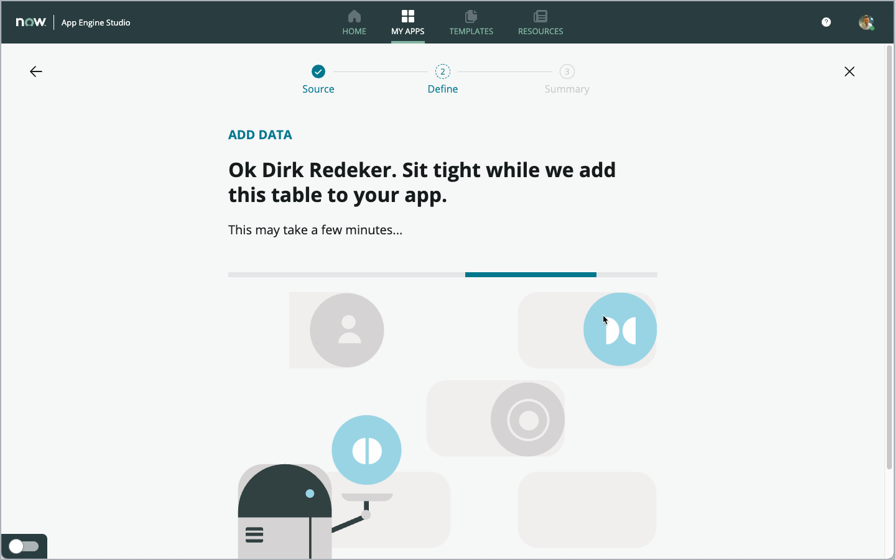

App Engine Innovation Workshop Lab Guide 
{: .fs-8 .fw-300 .m-0}

---
{: .mt-0}

# Exercise 2: Import data and create tables
{: .mt-2}

[Prev](10-exercise-1.md){: .btn .mr-2 .fs-2}
[Next](30-exercise-3.md){: .btn .btn-green .fs-2}

Goal
{: .fs-6 .fw-300 }

In this exercise, you will add **new tables** to your App.

This is the place where your data will be stored within your ServiceNow Instance. Because ServiceNow has a database built-in on the platform, it is very easy to create new tables for your App.

Add the first table (Import from spreadsheet)
{: .fs-6 .fw-300 }

The first table you create, will be set up in an **easy and fast** way, by importing and converting an existing Excel file to a working table in ServiceNow.

In the same moment, you will also **import the data** from the Excel file into the new table in your App.

**Let's go...**

1. Start adding tables by clicking the **Add** button **(1)** in the **Data** section.

    > **Note**: You can find the sections from the App Dashboard in App Engine Studio, where we stopped the previous exercise.

    

1. Select the option **Create a table (1)** - see screenshot below (in your instance, this card may be shown on the left, instead on the right like shown in the screenshot).

    

1. Click **Get started (1)**.

    > **Note**: If the button **Get started** is not visible on your screen, scroll down a bit.

    

1. In the next step, click the left-most option **Upload a spreadsheet (1)** and click **Continue (2)**.

    

1. Now add your **previously downloaded** Excel **spreadsheet** to import the data **structure** and the **data** in **one step**.

    You can click the link **(1)** to open your file selector dialog **OR** you can also drag and drop the file to the box **(1)** on the form.

    > **Note**: For convenience, here is the link to the Excel spreadsheet once more:

    [Click here to Download the Excel file](Activities.xlsx)

    

    

1. As soon as your **Excel file** is selected, you can see it shown in the dialog **(1)** - see screenshot below.

    Leave the value **"1"** in the field for the header line **(2)**. This defines the row in your Excel file holding the **field names** for your new table to create and import.

    Make sure, that you check the **Import spreadsheet data** checkbox **(3)**.

    This ensures that not only the table structure will be created, but also the data from the Excel spreadsheet will be imported to the newly created table as well.

    Click **Continue (4)** to move on.

    > **Note**: You can change the selected file, if you chose a wrong file. To chose a different file, click the trashcan icon and select the file desired.

    

    The system then analyzes the Excel file. This takes a few seconds.

    

    For reference, you can see the content of the Excel file in the screenshot below:

    

    Review the table columns identified from the previous step.
  
1. Find the *Status* field **(1)** and change the *Type* of that field to **Choice (2)**.

    This results in the Status field displayed as a **dropdown field in ServiceNow**, where all options from the Excel file are available for selection automatically.

    

1. Scroll down in the list of fields to the *Teacher** field **(1)** and change the **Type** column **(2)** to **Reference**.

    In the *Reference table* column **(3)** select the **User [sys_user]** table from the list of tables.
    
    > **Note**: As this list contains a lot of tables, type **sys_user** in the search field to faster find the User table.

    

1. Click the **Continue** button **(4)**.

    > **Note**: The *Teacher* field references an existing system table (*User [sys_user]*). Using a reference field here improves reporting capabilities and reduces human data entry issues.

1. Enter the name **Activity** for the new table in the *Table label* field **(1)**. No changes are needed for *Table name* (2).

1. Select the **Auto number** checkbox **(3)** and enter **ACTIV** (all capital letters) in the **Prefix** field **(4)**. The Prefix is used for the automatic numbering of records, e.g. like "ACTIV0001001", giving each row in the table a unique human readable number.

    No changes are needed to the two fields *Starting number* and *Number of digits (5)*.

1. Click **Continue (6)**.

    

1. In this step, you define, which Roles will have access to the table data in it.
Mark the checkbox in the **All** column for the "admin" Role (1) and the "user" Role (2). Then click **Continue (3)** to proceed.

    

    The system takes a few seconds to create the table and import the data from the spreadsheet to the new table.

    

1. When the import has finished, click **Done (1)**.

    

    You can now see, that your table is shown in the *Data section* of your App Dashboard.

    

Add the second table (Create from existing table)
{: .fs-6 .fw-300 }

Now, let's add another table to your app. This time, create a new table based on the structure of an existing table (the **Task** table) in ServiceNow.

<!-- Removed the Note below because it said the same thing -->

By *extending* an existing table, your new table inherts several fields and functionality from the original table. This can save a lot of time when making tables when the situation calls for it.

1. On the *App Dashboard*, click **Add (1)** in the *Data* section.

    

1. Again, the wizard for adding tables to your app is started.

1. Like for the first table, click on the right-hand option **Create a table (1)**.

    

1. Scroll down a bit an click **Get stated (1)**.

    

1. This time, click the option in the middle **Create from an existing table (1)** then click **Continue (2)**.

    

1. In the *Table* field **(1)**, select the **Task [task]** table and click **Continue (2)**.

    > **ATTENTION**: There are a lot of tables named something with ***“task”***. Be sure to choose the table named **Task [task]**. Type **Task** in the Table field to narrow the list of tables shown in the dropdown. Then select the table named "Task" (with the small "task" below).

    

    

1. In the *Table label* field **(1)**, enter **Permission Task** and check the **Auto number** heckbox **(2)**.

1. Enter **PERMTASK** (all in capital letters) in the **Prefix** field **(3)**. No other fields need to be changed here.

1. Click **Continue (4)** to proceed.

    

1. Mark the both checkboxes in the "All" column (1) and (2) to allow access to the new table for the "admin" and "user" role of your App. Then click **Continue**.

    

    The system takes a few seconds to create the new table in your app.

    

1. Click **Done** to end the wizard and return to your App Dashboard

    

    Verify that you have the **Permission Task** table now also added to your app.

    

!!! Congratulations !!!
{: .fs-6 .fw-300 }

You have just created two new tables for your app. The tables and their data will be stored in the database of your instance.

You used two different methods to create those tables. The first, uploading an Excel spreadsheet and the second, extending form an existing table in your instance.

> **Remember**: the *Task* table is a very central and important table in ServiceNow. Starting workflows by extending from the Task table provides a lot of functionality to your app as a baseline. That is a very nice and fast way to jump start new applications.
