# Exercise 3: Configure List & Form Layout

Goal
{: .fs-6 .fw-300 }

In this exercise, you will design the list and forms for your new tables, so that they have a meaningful layout for later use.

This all can be done in very fast and easy way - without writing any single line of code.

Configure the Activity List & Form
{: .fs-6 .fw-300 }

1. Select the **End time** field (1) and use the ***Up*** and ***Down*** buttons **(2)** to adjust the order of the field to what is shown in the screenshot.

1. Start by going to your app's *App Dashboard*.

1. Click **Preview (1)** on the *Activity* table **(1)**.

    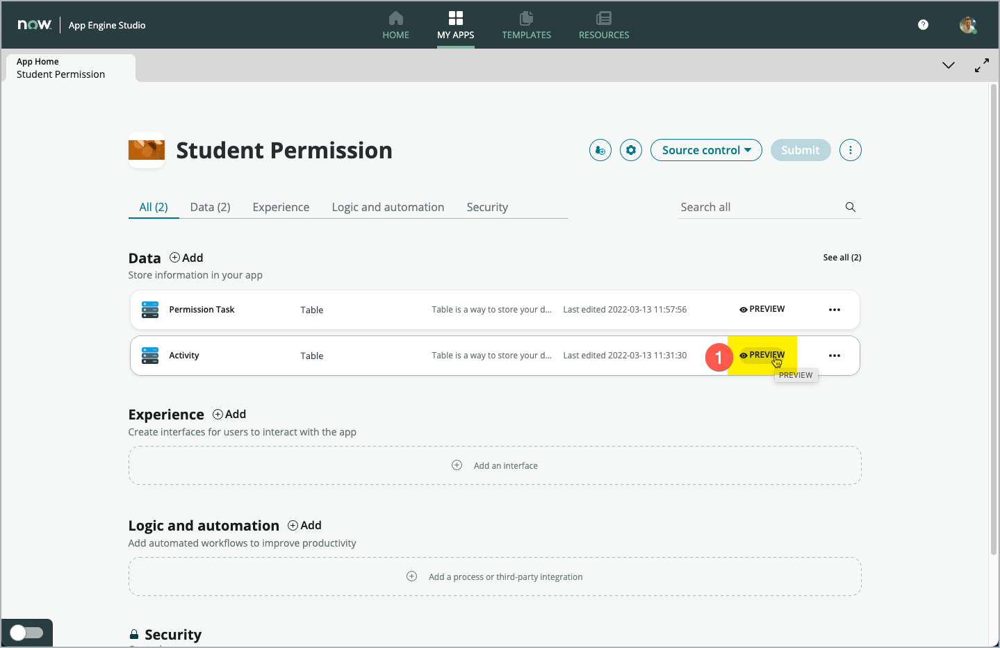

    A new Web Browser tab **(1)** opens and the prebuilt list layout for the *Activity table* is displayed. How nice, you do not need to build a view from scratch. The system does this automatically for you at the same time the tables were created.

    > **Note**: You can see, that each record imported now has a unique *Number (2)* and that the *Teacher* column **(3)** is now a reference field (in blue letters, shown like a hyperlink). Instead of just using the name of the given teacher in that column, it refers to a specific user record in the *User [sys_user]* table, which we specified during the import.

    The *User* table is another important base table. It's where all users are stored. You can leverage it for your new app and do not need to create a separate user table for each app.

    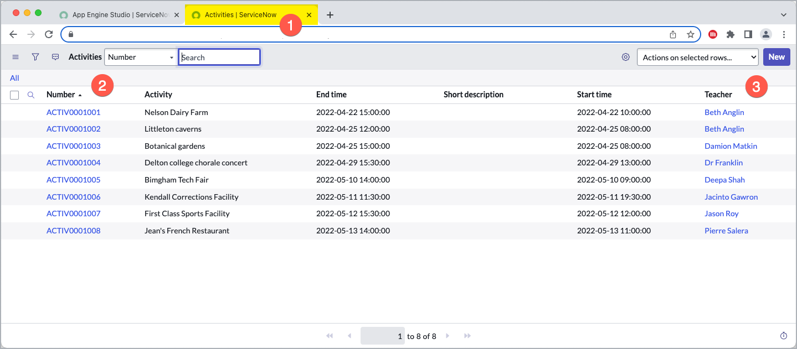

    Now it's time to adjust the list layout a bit. We'll order the fields from left to right.

    Move your mouse over the header of the **Number** column **(1)** so that the three vertical dots (1) appear and click on the three-dot button to open the **Column Context-menu***.

1. In the menu that opens, select **Configure (2)** and in the sub-menu select **List Layout (3)**.

    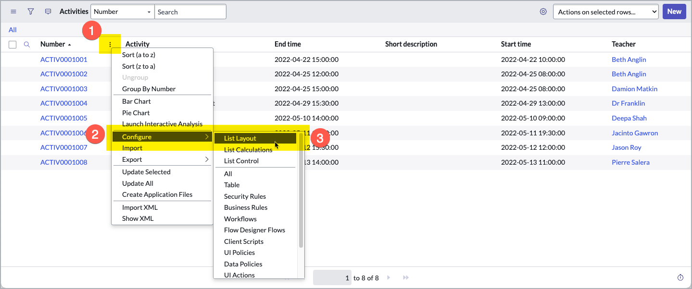

1. Select the **End time** field (1) and use the ***Up*** and ***Down*** buttons **(2)** to adjust the order of the field to what is shown in the screenshot.

    > **Note**: You can configure the List according to your preferences. For this Lab, just make sure, that the **Number** field **(3)** will remain the first field in the List.

    When you have finished adjusting the List fields, click **Save (4)**.

    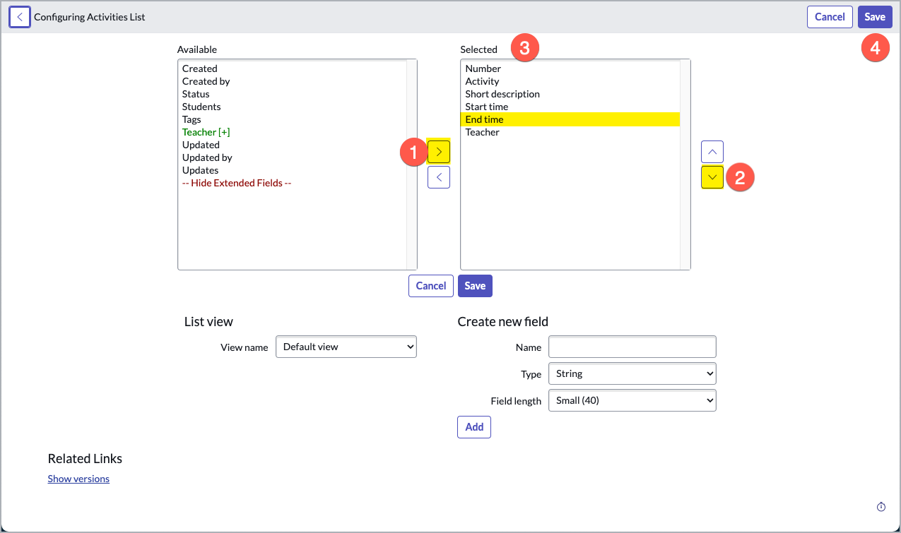

    The Fields are now arranged in the List in the way you just set them up.

    Now let’s review and configure the Form of the Activity table.

1. From the your App Dashboard, click the **Activity table** name **(1)**.

    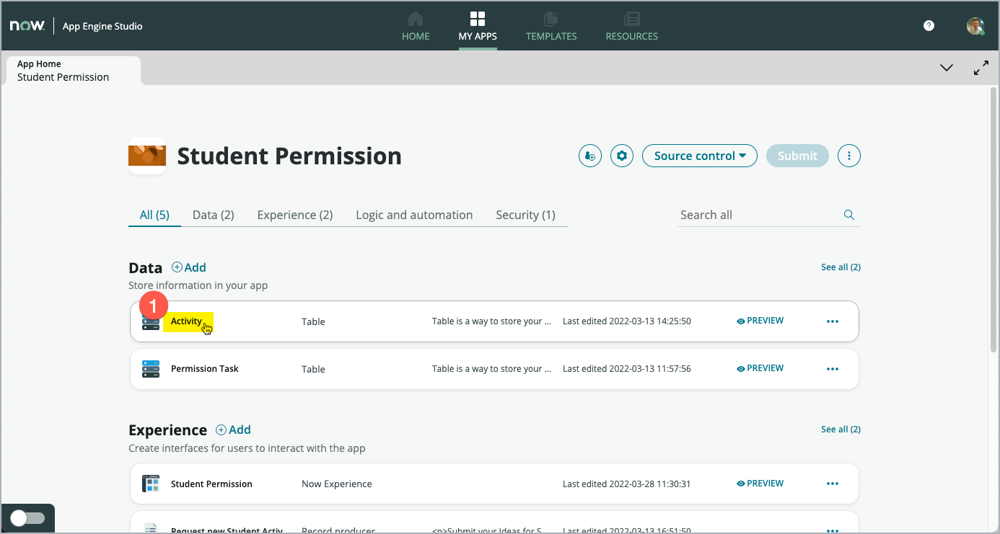

    The table builder opens and a splash screen appears.

1. Click the **X** in the upper-right corner of the popup to close the Welcome screen.

    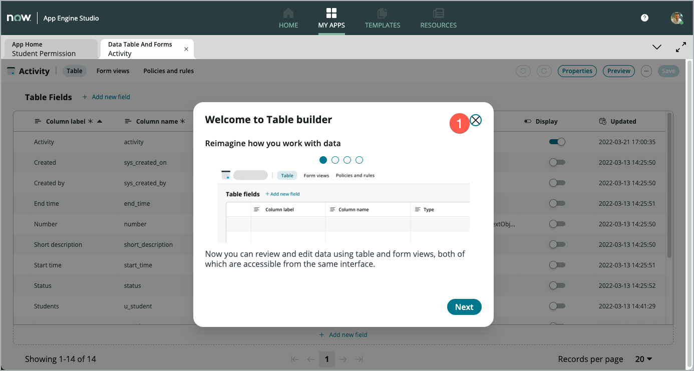

1. Click **Form views (1)** to open *Form Builder*. Form Builder enables you to design the layout of the form for this table.

    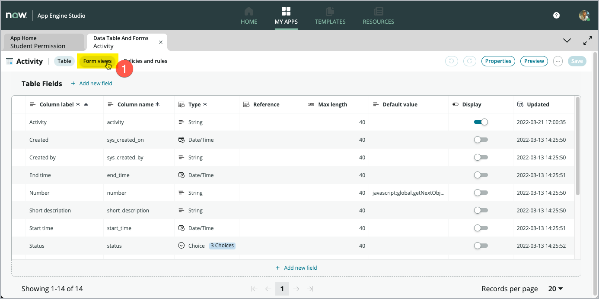

    > Form Builder is more than a graphical user interface for optimizing your form Layout. Form Builder also allows to add new fields to your form, which instantly become new fields on your table.

    Click **Create a field in the table** to open a popup window to create a new field.

    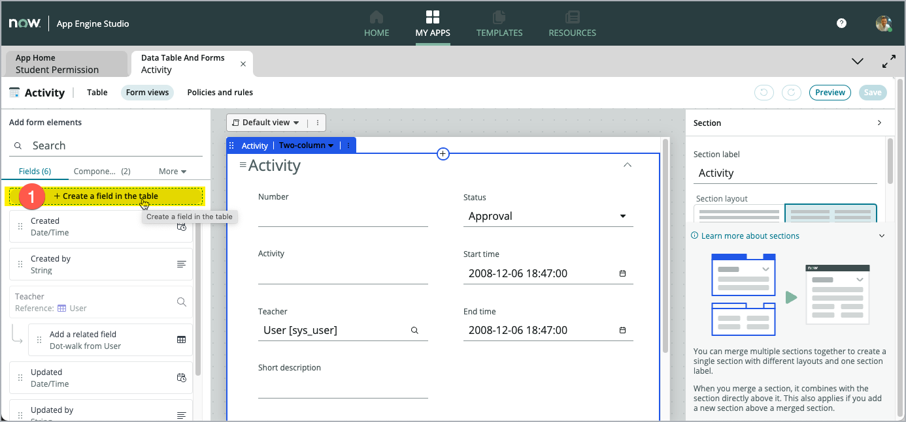

    Next, we'll add a new field of type *List*. This type of field allows to collect a number of references in one field (instead of only referencing ONE record).

1. In the *Column label (1)* field type **Students** and in **Column name (2)** type **u_students**.

1. Set the *Type (3)** field to **List** and  the **Table to reference (4)** field to **User** \[sys_user\] table.

1. Click **Add** to add this new field to the table.

    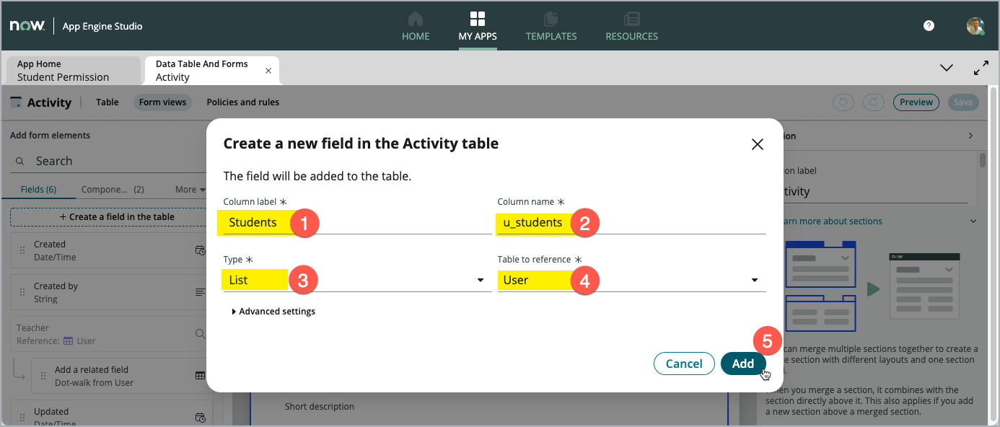

1. Click **Done** to close the dialog window.

    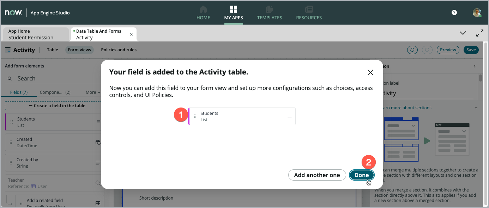

1. Finally, drag the new field *Students* from the left-hand side pannel **(1)** onto the form canvas **(2)**.

1. Click **Save** to make the changes permanent.

    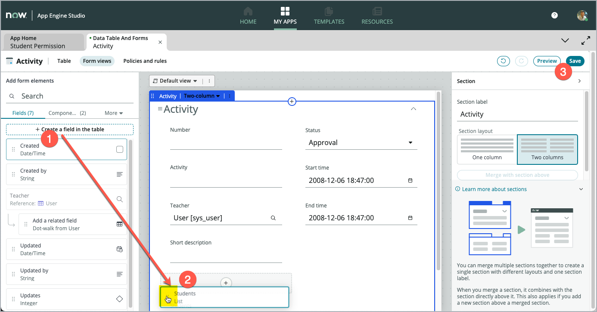

    > **Note**: You can enhance your form layout by adding **Sections** and choose from one or two column format. The fields can easily be arranged by drag-and-drop to make the form fit best to your need. Pay attention to other forms in the system to ensure consistency (e.g. placement of the number field in the upper left.) All this adds up to a much better user experience.

1. Click **Preview** to open a new tab. The system opens a new App Engine Studio tab showing the Form layout

    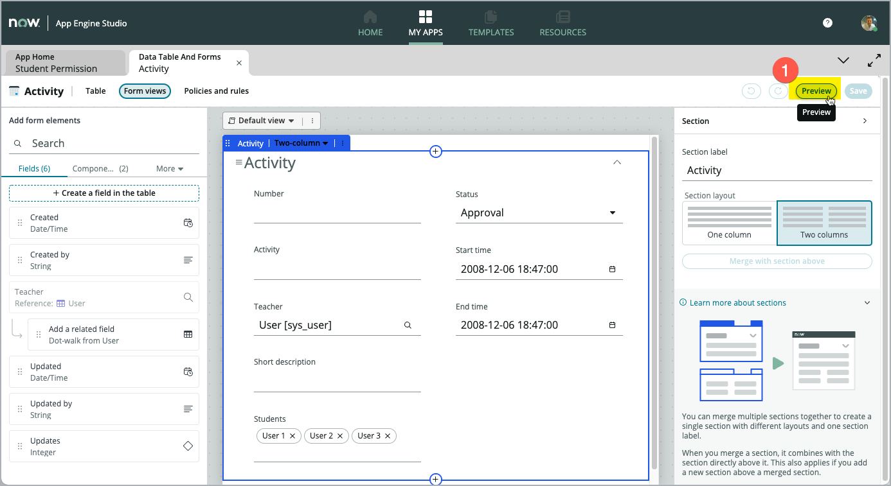

    The form shown on the new tab **(1)** looks like the layout used in Workspaces.

    The new **Students (2)** field, that we just added in the steps above, is already shown on the form.

    You can also show the layout shown when using the same Form in the **Plaform UI**.

1. Click **Open form in Platform (3)** to open another Tab in App Engine Studio.

    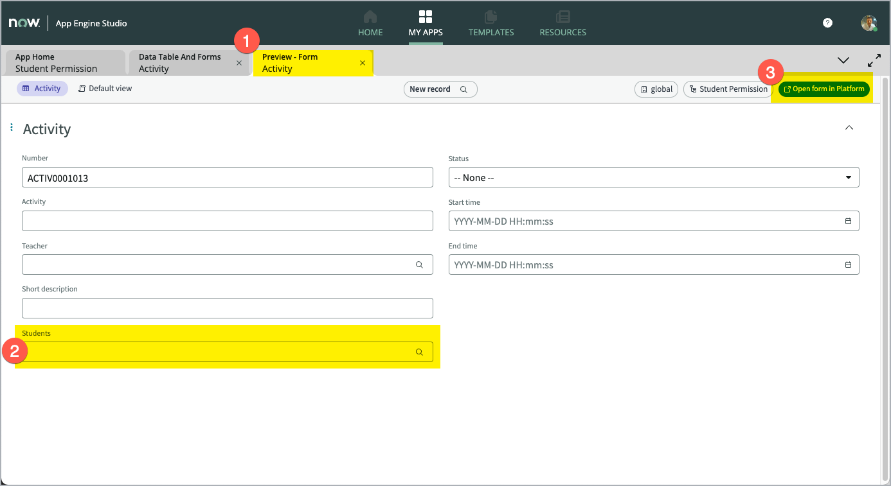

    You can see the layout in the *Platform UI* looks different, especially for the new list field *Students*. However, the functionality is the same for either UI.

    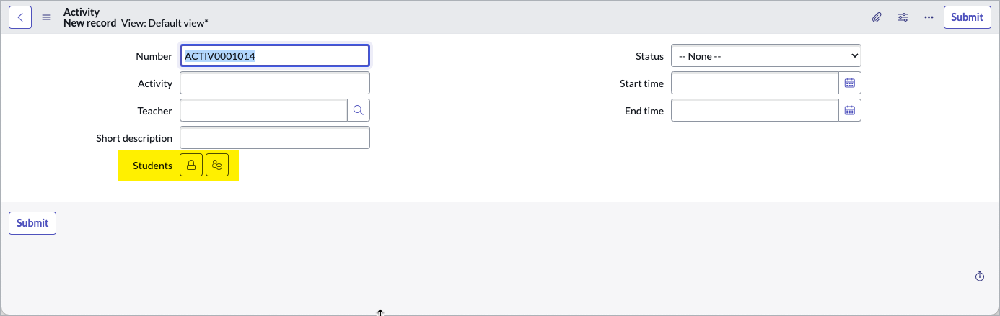

CONGRATULATIONS! You just achieved to set up your list and form for future use.
{: .fs-6 .fw-300 }