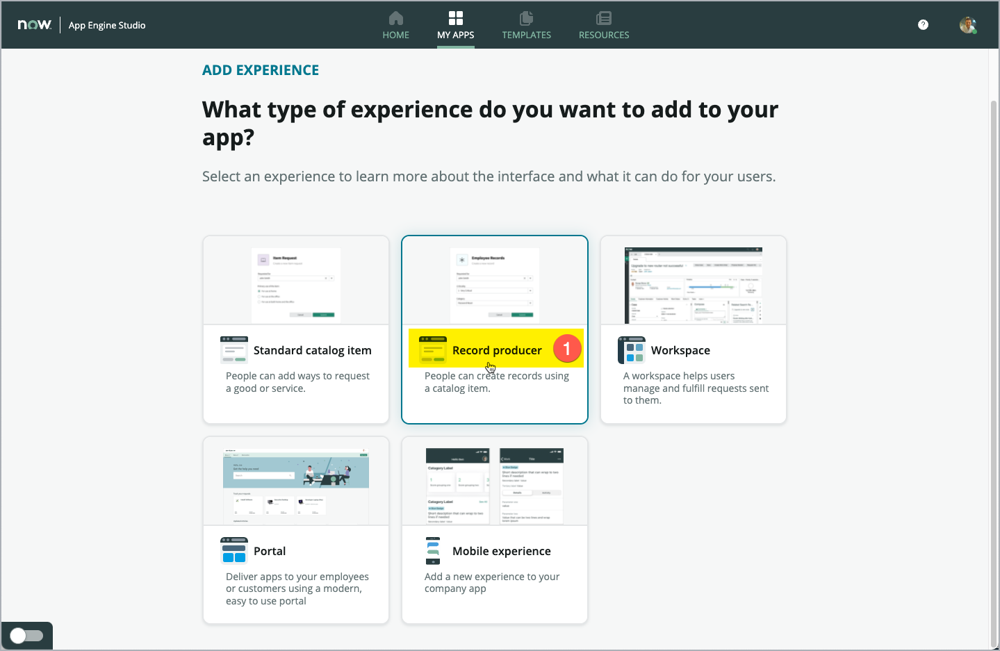
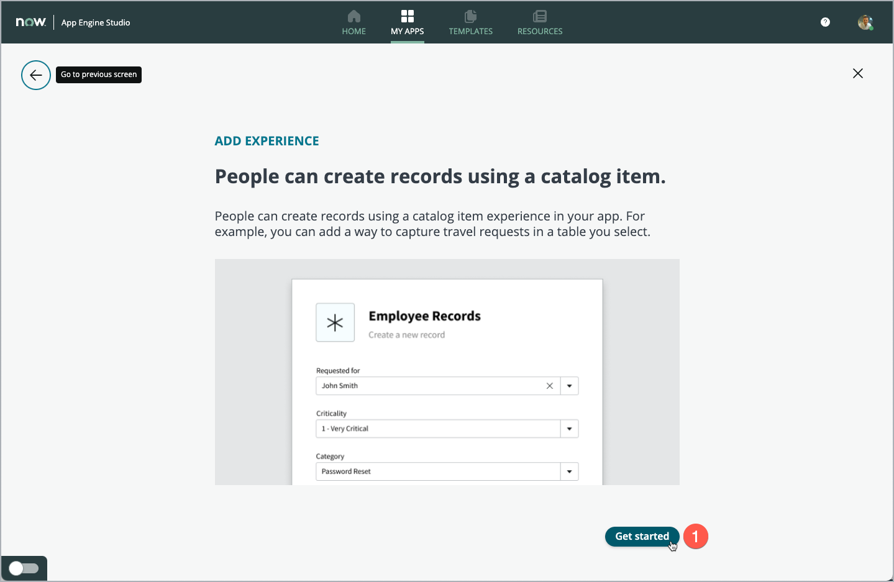
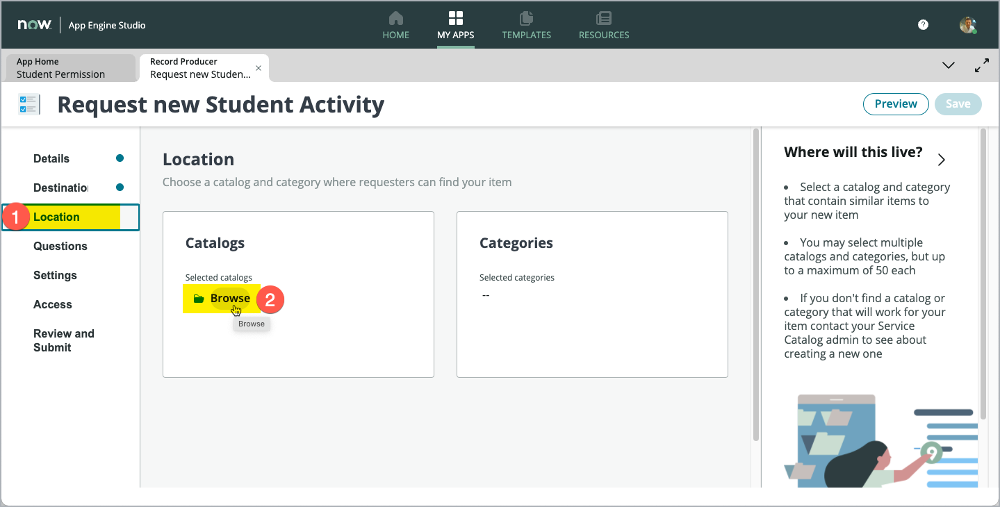

App Engine Innovation Workshop Lab Guide 
{: .fs-8 .fw-300 .m-0}

---
{: .mt-0}

# Exercise 4: Start from Parents Portal

[Prev](30-exercise-3.md){: .btn .mr-2 .fs-2}
[Next](50-exercise-5.md){: .btn .btn-green .fs-2}

## Goal
In this exercise, you will create a *Record producer* which will be made available in the *Service Catalog* of the *Service Portal*. That way, users can easily add or request new student activities.

The Service Portal is the perfect one-stop-shop for all users to find all requests.

You will configure the Record Producer.

## Steps

1. Navigate to the App Engine Studio Dashboard of your app.

1. Click **Add (1)** in the *Experience* section of the App Dashboard .

    

1. On the next screen, click the **Record producer** tile **(1)**.

    

1. Click **Get started (1)**.

    

1. Capture a meaningful *Name (1)* for the new record producer and enter a *Short description (2)* below.

1. Click **Continue (3)** when done.

    

    The system then creates a record producer.

    

1. Click **Edit record producer (1)**.

    

    The *Catalog Builder* is displayed in a new tab inside App Engine Studio.

    On the left-hand side, you can see a *Navigator*. This shows the steps to take to complete the process of building a record producer. Currently we are on the *Details* page **(1)**, which displays the both values *Item name (2)* and *Short description (3)*, that we just entered.

    

1. Scroll down the page and capture a short text in the **Description** field **(1)**. This is shown in Service Portal when the record producer is used.

    > **Note**: You can format your text, insert hyperlinks and even insert images. You can be creative and make your record producer more compelling.

    

1. Select the **Destination** section **(1)** in the left-hand navigator then select the **Activity** table in the **Record submission table** field **(2)**.

    > **Note**: This defines where the data from your record producer is stored.

    

1. Select the **Location** section **(1)** in the left-hand navigator and click **Browse (2)** in the **Catalogs** box on the left side.

    

1. On the screen that opens, you now can select the Catalogs, that will contain this Record Producer. All Service Portals using the given Service Catalog with then contain this Record Producer – being available for the users to engage with.

    Select the **Service Catalog** entry in the left list **(1)** and click **Add** button **(2)** to move the selected **Service Catalog** entry to the right list (which is the list of Service Catalogs, the current Record Producer will be available in).

    

1. Review, that the **Service Catalog** entry **(1)** now is shown in the right list and then click **Save selections (2)*.

    

1. Back on the **Location** page **(1)**, check that the **Service Catalog** entry is now listed in the **Catalogs** box **(2)**.

    After selecting to which Catalogs the Record producer will be allocated, we now will select the Categories, where the user can find the Record producer inside the given Catalog.
    Click **Browse (3)** in the Categories box to navigate to the next screen.

    

1. To allocate Categories, select the given Category in the left-hand list **(1)** and click **Add (2)**.

    For our Lab, we select the **Can We Help You?** Category on the left side and click **Add**.

    

1. Review, that the Category now is showing up in the right-hand list **(1)** and then click **Save selections (2)**.

    

1. Check, that the selected Category now will be shown in the right side **Categories** box **(1)**.

    

1. Let’s move on in the next section in the left-hand navigator.
    Select the **Questions** section **(1)** to define the input form fields (questions) that will be shown in Service Portal when using this Record Producer.

    To add the first form field (question), click **Insert new question (2)** in the top part of main form.

    

1. The new page that opens, is used to configure the form field / question.
    There are different tabs on this page, which will be relevant for different configuration details. For our Lab, we keep it fast and simple and fill in only a few mandatory fields.

    On the **Question** tab **(1)** leave the **Question type** field with its default value **Text (2)** and select **Single-line** in the **Question subtype** field **(3)**.

    

1. Scroll down on the page to the **Details** section.
    Mark the **Map to a specific field on the table** checkbox **(1)**, which makes the **Table field** field appear on the screen.
    Select the **Activity** field in the **Table field** field **(2)**.
    In the **Question label** field **(3)**, capture the label that will be shown in Service Portal for this Record Producer and this specific field (e.g. **“A short name for the Activity”**).
    Leave the default for the **Name** field **(4)** untouched.

    > **Note**: Place your mouse pointer in the main area of the form to scroll down.

    

1. Again, scroll down a bit on the page to show the three checkboxes at the bottom of the screen. Select the **Mandatory** checkbox **(1)** and click **Insert Question** **(2)**.

    

1. Back on the **Questions** Page of the Catalog Builder, you can find the question added **(1)** to the list of questions.

    Try another way to add questions to your Record Producer by clicking **Insert** below **(2)** the newly added question.
    In the popup window, select the **New question** option **(3)** to add a second question to your Record Producer.

    

1. On the page that opens, like for the first question, just set the **Question subtype** field on the **Question** tab **(1)** value to **Single-line (3)**. Leave the **Question type** with the default set to **Text (2)**.

    

1. Again, select the **Map to a specific field on the table** field **(1)**, and select the **Short description** field in the **Table field** field **(2)**.
    Enter a meaningful label to show for that field/question on the Record Producer in Service Portal, using the **Question label (3)** field (e.g. **Enter a short description for the Activity**).

    We do not want this field/ question to be mandatory, so we can add this question by clicking **Insert Question (4)** right now.

    

1. Back on the Catalog Builder, you can review that **both question** are now shown in the list of questions **(1)**.

    

1. Select the **Settings** section **(1)** in the left-hand navigator and mark the **Hide ‘Add to wishlist’ button** checkbox **(2)**.

    

1. Skip the **Access** section in the left-hand navigator and select the **Review and Submit** section **(1)**. Click **Submit (2)** to save and publish the Record Producer to the Service Portal.

    

GREAT !!!
{: .fs-6 .fw-300 }

    Your Record Producer is now available in the Service Portal for your users to Request for new Student Activities.

1. Click **Return to my application (1)** to close the tab with the **Catalog Builder**, which should bring you back to your App dashboard in App Engine Studio.

    

1. Back on the dashboard of your App, review the new **Record producer (1)** showing up in the **Experience** section.

    

Test the Record Producer in the Portal
{: .fs-6 .fw-300 }

That was a perfect start into the world of No-Code/Low-Code development on the ServiceNow platform.

1. Open Service Portal
    On a new Web Browser Tab, use the suffix **"/sp"** added to the URL (e.g. "CCL1054-K22.xxxxxx.service-now.com") of your Lab instance to open Service Portal. (https://CCL1054-K22.xxxxxx.service-now.com/sp) make sure to use the correct instance URL from the instance you are now using for this lab, instead of the "xxxx" part above)

1. Click **Request Something (1)** in the left-middle part of Service Portal screen to navigate to the Service Catalog.

    

1. In the left-hand navigation for **Categories** select the **Can We Help You?** category (1), which also will be reflected in the breadcrumbs above. Then find your new Record producer "Request new Student Activity" (2) and click it to navigate to the Record Producer in Service Portal.

    

1. The Record Producer will be shown. To test it, just fill in the fields on the screen (1) and (2). Then, click **Submit** (3) to submit the form and create a new record in the underlying table.

    

Review the data created
{: .fs-6 .fw-300 }

1. From the Dashboard of your App in App Engine Studio, click **Preview** (1) on the **Activity** table.

    

1. Find your newly created record in the list. This will be the record with the highest Number (1).
Click that record on the first column, to open the record in Form view.

    

1. The Form view shows the data captured within the Record Producer on the Service Portal. Review the fields "Activity" (1) and Short description (2).

    

Congratulations, you have successfully created an easy to use form to create new activities.
{: .fs-6 .fw-800 }

This Form can easily be found and used from your central Service Portal.

[Prev](30-exercise-3.md){: .btn .mr-2 .fs-2}
[Next](50-exercise-5.md){: .btn .btn-green .fs-2}