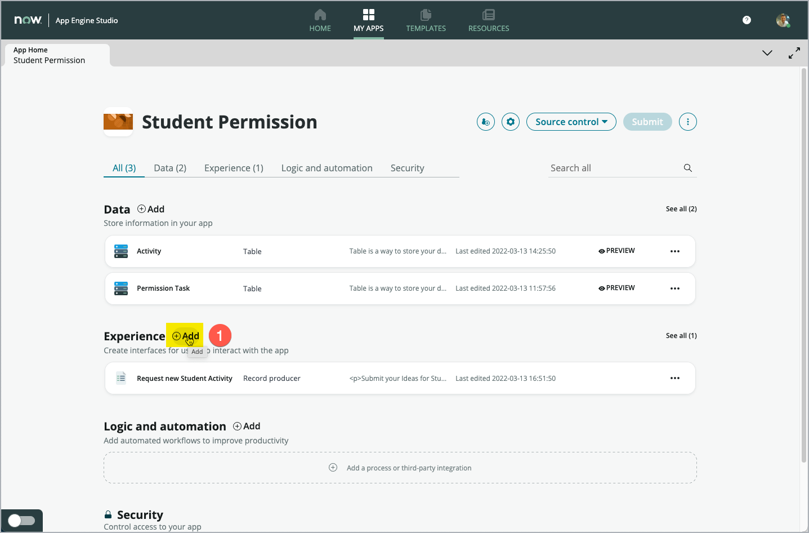
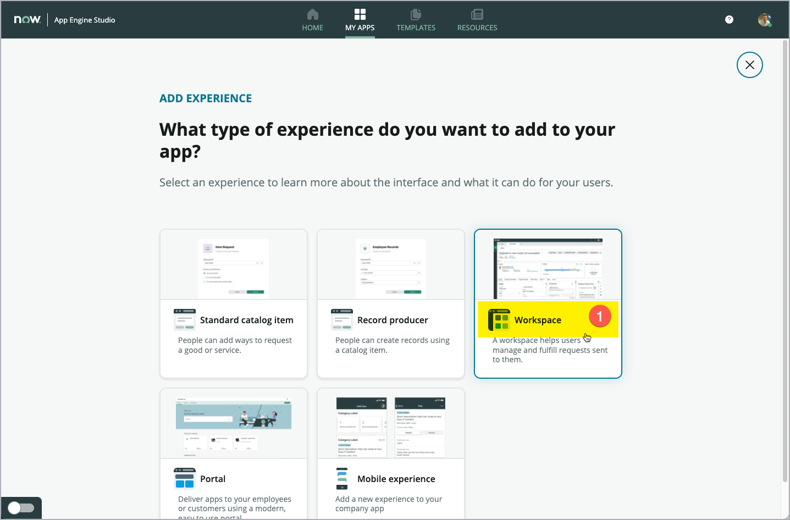
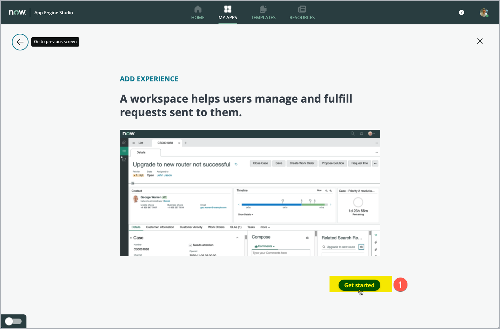
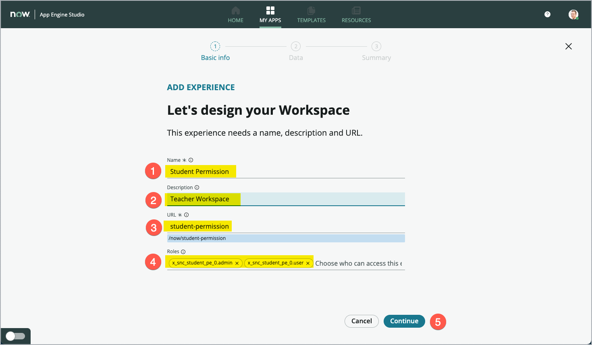
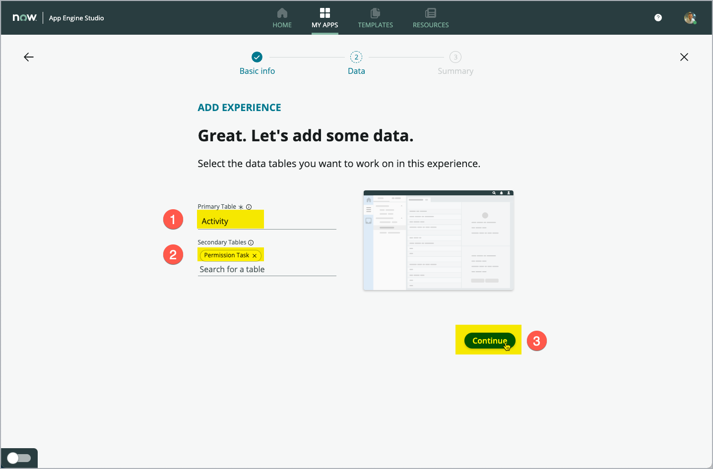
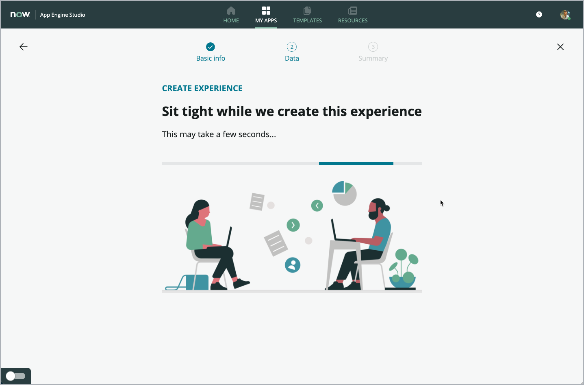
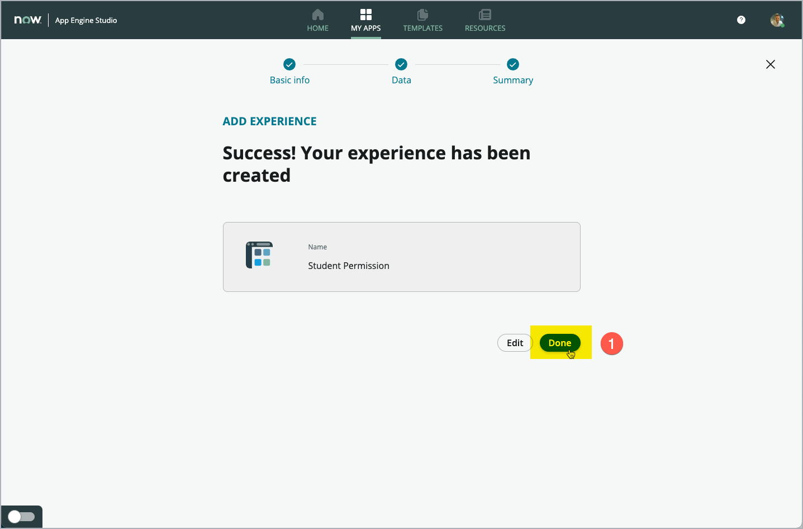
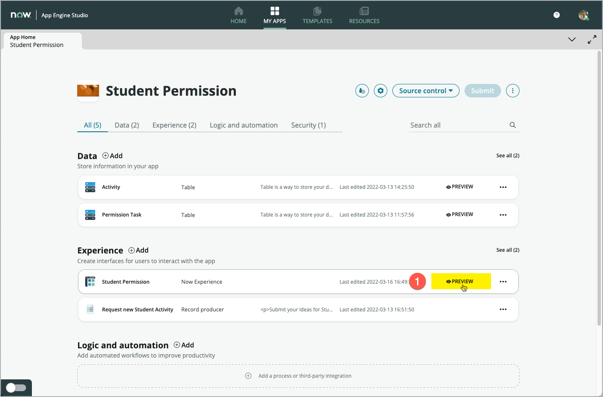
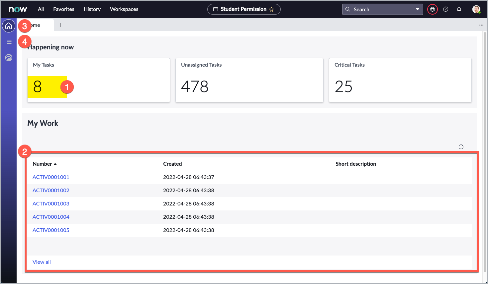
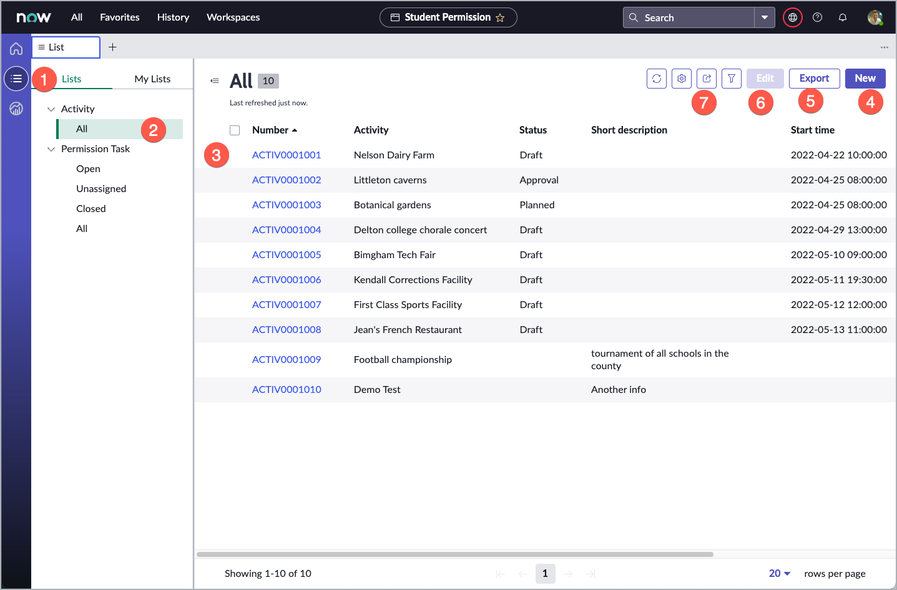

App Engine Innovation Workshop Lab Guide 
{: .fs-8 .fw-300 .m-0}

---
{: .mt-0}

# Exercise 5 - Create a Teachers Workspace

[Prev](40-exercise-4.md){: .btn .mr-2 .fs-2}
[Next](90-summary.md){: .btn .btn-green .fs-2}

## Goal
This Lab starts from the Dashboard of your App in App Engine Studio

You will create the Workspace in App Engine Studio.

## Steps

1. Click **Add (1)** in the **Experience** section on your App Dashboard

    

1. This start the wizard to add another user experience to your App.
    On the first screen of the wizard, chose which kind of experience you want to create.
    This time, click the **Workspace (1)** tile.

    

1. You will presented with an example of what a Workspace may look like.
    Just click **Get started (1)** to move on.

    

1. The default Name is set to **Student Permission** (the name of your App).
    Leave the **Name** field **(1)** untouched, and enter **Teacher Workspace** in the **Description** field **(2)**.
    The **URL** field **(3)** is filled automatically as well. Leave the value also untouched.

    The **Roles** field **(4)** is used to limit access to the workspace. For this exercise, we leave this field empty as is.

    > **Note**: If the **Continue** button **(5)** is disabled, just click into the **Name (1)** field and press the TAB Key. That will enable the **Continue** button.

    Click **Continue (5)** to move on

    

1. For the "Primary Table" field, selc

    

    

    

Review the Workspace
{: .fs-6 .fw-300 }

1. Back on you App Dashboard, you will find the new Workspace listed in the "Experience" section (1).
    Click **Preview** to open your newly created Workspace on a new Browser Tab.

    

1. The Workspace will open the landing page, which is more like a dashboard for your App.
    You can find a single score KPI already created for you (1). This counts the number of Records in your Table, you extended from "Task".
    Below, you can find a list with the first five records of your "Activity" table (2). Below the list, you find the Link "View all", which you can use to navigate to the full list of all Activity Records in your table.
    On the left side, you find a vertical navigation bar, which already has some icons prepared for you. The topmost icon (with the small house) navigates to the landing/home page of this Workspace (3) - that is the page you currently are viewing.
    Below (4), you can see an icon to navigate to an overview of all Lists, that are configured for this Workspace. Click this "List" icon (4) to show the list treeview.

    

1. This screens shows the overview of Lists (1) for your Workspace. The left tab "Lists" is predefined by the Administrator and the right tab "My List" can be configured on a per user base individually.
This all is based on very powerful components, which makes up the pages of your new Workspace. They can easily be configured to your specific needs, without writing any line of code.
You find Lists arranged in Categories (2) the List itself (3) depening on the list selected in the left tree structure.
Note, that you already can create "New" record (4), "Export" the data (5), "Edit" (6)existing records and also can used more advanced functions like filtering (7) the data, etc.

    

Results
{: .fs-6 .fw-500 }

!!! PERFECT !!!
{: .fs-6 .fw-800 }

You just have created your first Workspace with App Engine Studio, just within a few clicks.

[Prev](40-exercise-4.md){: .btn .mr-2 .fs-2}
[Next](90-summary.md){: .btn .btn-green .fs-2}